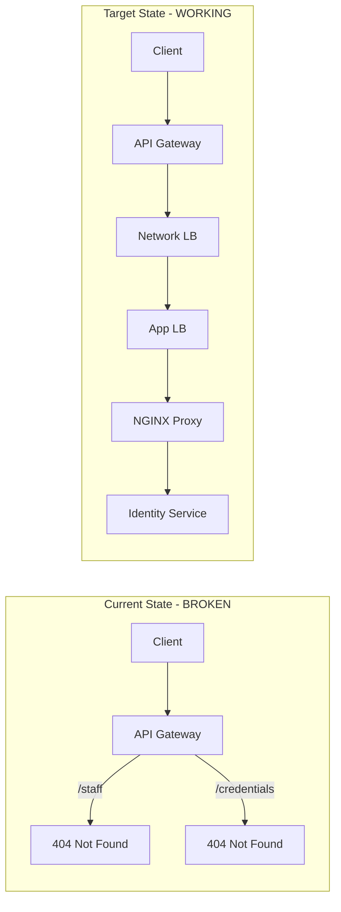

# API Gateway Configuration and Testing Plan

## Critical Finding: Missing Route Configurations

The new Staff, Credentials, and Leave modules are implemented in the Identity service but **NOT exposed through API Gateway or NGINX**. Requests to these endpoints will fail.



---

## Phase 1: NGINX Configuration Update

**File:** [`server/application/reverseproxy/nginx.template`](server/application/reverseproxy/nginx.template)

**Changes Required:**

### 1.1 Add `/staff` route (currently returns 501)

Replace the 501 placeholder with proper routing:

```nginx
# Staff management: CRUD, credentials, leave (Identity Service)
location ~ ^/staff {
  if ($request_method !~ ^(GET|POST|HEAD|OPTIONS|PUT|PATCH|DELETE)$) {
    return 405;
  }
  proxy_pass http://identity-api.${NAMESPACE}.sc:3010;
  proxy_http_version 1.1;
  proxy_set_header Upgrade $http_upgrade;
  proxy_set_header Connection 'upgrade';
  proxy_set_header Host $host;
}
```

### 1.2 Add `/school-years` route (MISSING)

```nginx
# School years: tenant-wide academic year aggregation (Identity Service)
location ~ ^/school-years {
  if ($request_method !~ ^(GET|POST|HEAD|OPTIONS|PUT|PATCH|DELETE)$) {
    return 405;
  }
  proxy_pass http://identity-api.${NAMESPACE}.sc:3010;
  proxy_http_version 1.1;
  proxy_set_header Upgrade $http_upgrade;
  proxy_set_header Connection 'upgrade';
  proxy_set_header Host $host;
}
```

### 1.3 Add `/credentials` route for expiring credentials endpoint

```nginx
# Credentials: expiring credentials lookup (Identity Service)
location ~ ^/credentials {
  if ($request_method !~ ^(GET|POST|HEAD|OPTIONS|PUT|PATCH|DELETE)$) {
    return 405;
  }
  proxy_pass http://identity-api.${NAMESPACE}.sc:3010;
  proxy_http_version 1.1;
  proxy_set_header Upgrade $http_upgrade;
  proxy_set_header Connection 'upgrade';
  proxy_set_header Host $host;
}
```

---

## Phase 2: API Gateway Configuration Update

**File:** [`server/lib/tenant-api-prod.json`](server/lib/tenant-api-prod.json)

Add the following route definitions (following existing patterns):

### 2.1 Staff Routes

| Method | Path | Description |

|--------|------|-------------|

| GET | `/staff` | List all staff |

| POST | `/staff` | Create staff |

| GET | `/staff/{staffId}` | Get staff by ID |

| PATCH | `/staff/{staffId}` | Update staff |

| DELETE | `/staff/{staffId}` | Delete staff |

| PATCH | `/staff/{staffId}/employment-status` | Update employment status |

| POST | `/staff/{staffId}/assignments` | Assign staff to school |

| GET | `/staff/search/{term}` | Search staff |

### 2.2 Credentials Routes

| Method | Path | Description |

|--------|------|-------------|

| GET | `/staff/{staffId}/credentials` | List credentials |

| POST | `/staff/{staffId}/credentials` | Create credential |

| GET | `/staff/{staffId}/credentials/{credentialId}` | Get credential |

| PATCH | `/staff/{staffId}/credentials/{credentialId}` | Update credential |

| DELETE | `/staff/{staffId}/credentials/{credentialId}` | Delete credential |

| PATCH | `/staff/{staffId}/credentials/{credentialId}/verify` | Verify credential |

| GET | `/credentials/expiring` | Get expiring credentials |

### 2.3 Leave Routes

| Method | Path | Description |

|--------|------|-------------|

| GET | `/staff/{staffId}/leave` | List leave requests |

| POST | `/staff/{staffId}/leave` | Create leave request |

| GET | `/staff/{staffId}/leave/{leaveId}` | Get leave request |

| PATCH | `/staff/{staffId}/leave/{leaveId}/approve` | Approve leave |

| PATCH | `/staff/{staffId}/leave/{leaveId}/reject` | Reject leave |

| PATCH | `/staff/{staffId}/leave/{leaveId}/cancel` | Cancel leave |

### 2.4 School-Scoped Staff Routes

| Method | Path | Description |

|--------|------|-------------|

| GET | `/schools/{schoolId}/staff` | List staff in school |

| POST | `/schools/{schoolId}/staff` | Create staff in school |

---

## Phase 3: Deployment Steps

### 3.1 Update and Deploy NGINX

```bash
# 1. Update nginx.template file (Phase 1 changes)

# 2. Rebuild and push rproxy container
cd server/application/reverseproxy
docker build -t <ACCOUNT_ID>.dkr.ecr.<REGION>.amazonaws.com/rproxy:latest .
docker push <ACCOUNT_ID>.dkr.ecr.<REGION>.amazonaws.com/rproxy:latest

# 3. Force new deployment of ECS service
aws ecs update-service --cluster <CLUSTER> --service <SERVICE> --force-new-deployment
```

### 3.2 Update API Gateway

```bash
# 1. Update tenant-api-prod.json file (Phase 2 changes)

# 2. Deploy CloudFormation stack (or CDK)
cd server
cdk deploy TenantAPIStack --require-approval never

# OR if using CloudFormation directly:
aws cloudformation deploy \
  --template-file tenant-api.yaml \
  --stack-name edforge-tenant-api \
  --parameter-overrides Stage=prod
```

---

## Phase 4: API Testing Document (Postman)

### Prerequisites

1. **Base URL:** `https://api.<tenant>.edforge.io` or local `http://localhost:3010`
2. **Auth Token:** Valid JWT from `/auth/login`
3. **Headers:**

   - `Authorization: Bearer <token>`
   - `Content-Type: application/json`

### Test Sequence (Chronological Order)

#### 4.1 School Management (Pre-requisite)

```
1. GET /schools                    → List schools (get schoolId)
2. POST /schools                   → Create school if none exist
```

**POST /schools payload:**

```json
{
  "name": "Test Elementary School",
  "shortName": "TES",
  "type": "elementary",
  "status": "active",
  "address": {
    "street1": "123 Education Lane",
    "city": "Springfield",
    "state": "IL",
    "zipCode": "62701"
  },
  "gradeRange": {
    "lowest": "kindergarten",
    "highest": "fifth"
  },
  "phone": "555-123-4567",
  "email": "info@test-elementary.edu"
}
```

#### 4.2 Staff Management

```
3. POST /staff                     → Create staff member
4. GET /staff                      → List all staff
5. GET /staff/{staffId}            → Get staff details
6. PATCH /staff/{staffId}          → Update staff
7. GET /schools/{schoolId}/staff   → List staff in school
8. POST /staff/{staffId}/assignments → Assign to another school
9. PATCH /staff/{staffId}/employment-status → Update status
10. GET /staff/search/{term}       → Search staff by name/email
```

**POST /staff payload:**

```json
{
  "staffUniqueId": "EMP-2026-001",
  "firstName": "Jane",
  "lastSurname": "Smith",
  "middleName": "Marie",
  "email": "jane.smith@test-school.edu",
  "phone": "555-987-6543",
  "primarySchoolId": "{{schoolId}}",
  "role": "teacher",
  "employmentType": "full_time",
  "hireDate": "2026-01-15",
  "department": "Mathematics",
  "title": "Math Teacher",
  "birthDate": "1985-06-15",
  "gender": "female",
  "highlyQualifiedTeacher": true,
  "yearsOfPriorTeachingExperience": 8,
  "addresses": [
    {
      "addressTypeDescriptor": "home",
      "streetNumberName": "456 Oak Street",
      "city": "Springfield",
      "stateAbbreviationDescriptor": "IL",
      "postalCode": "62702"
    }
  ],
  "emergencyContacts": [
    {
      "name": "John Smith",
      "relationship": "Spouse",
      "phone": "555-111-2222"
    }
  ]
}
```

**POST /staff/{staffId}/assignments payload:**

```json
{
  "schoolId": "{{anotherSchoolId}}",
  "role": "teacher",
  "department": "Mathematics",
  "isPrimary": false,
  "beginDate": "2026-01-20",
  "positionTitle": "Part-time Math Instructor",
  "fullTimeEquivalency": 0.5
}
```

**PATCH /staff/{staffId}/employment-status payload:**

```json
{
  "employmentStatus": "on_leave",
  "effectiveDate": "2026-02-01",
  "reason": "Medical leave"
}
```

#### 4.3 Credential Management

```
11. POST /staff/{staffId}/credentials      → Add credential
12. GET /staff/{staffId}/credentials       → List credentials
13. GET /staff/{staffId}/credentials/{id}  → Get credential
14. PATCH /staff/{staffId}/credentials/{id}/verify → Verify
15. GET /credentials/expiring?days=90      → Check expiring
```

**POST /staff/{staffId}/credentials payload:**

```json
{
  "credentialIdentifier": "IL-TEACH-2025-12345",
  "credentialTypeDescriptor": "license",
  "credentialFieldDescriptor": "mathematics",
  "issuanceDate": "2025-08-01",
  "expirationDate": "2030-08-01",
  "issuingState": "IL",
  "issuingOrganization": "Illinois State Board of Education",
  "gradeLevels": ["sixth", "seventh", "eighth", "ninth", "tenth", "eleventh", "twelfth"],
  "subjects": ["Algebra", "Geometry", "Calculus"],
  "name": "Illinois Professional Educator License - Mathematics",
  "description": "Secondary mathematics teaching license",
  "isRenewable": true,
  "renewalReminderDays": 180
}
```

**PATCH /staff/{staffId}/credentials/{credentialId}/verify payload:**

```json
{
  "verificationStatus": "verified",
  "verificationNotes": "Verified with ISBE database on 2026-01-11"
}
```

#### 4.4 Leave Management

```
16. POST /staff/{staffId}/leave            → Request leave
17. GET /staff/{staffId}/leave             → List leave requests
18. GET /staff/{staffId}/leave/{leaveId}   → Get leave details
19. PATCH /staff/{staffId}/leave/{leaveId}/approve → Approve
20. POST /staff/{staffId}/leave            → Another request
21. PATCH /staff/{staffId}/leave/{leaveId}/reject  → Reject
22. POST /staff/{staffId}/leave            → Third request
23. PATCH /staff/{staffId}/leave/{leaveId}/cancel  → Cancel
```

**POST /staff/{staffId}/leave payload:**

```json
{
  "leaveType": "annual",
  "startDate": "2026-03-01",
  "endDate": "2026-03-05",
  "durationType": "full_day",
  "reason": "Family vacation",
  "notes": "Will be traveling out of state",
  "substituteStaffId": "{{anotherStaffId}}",
  "coverageNotes": "Ms. Johnson will cover all classes",
  "emergencyContact": {
    "name": "John Smith",
    "phone": "555-111-2222",
    "email": "john.smith@email.com"
  }
}
```

**PATCH /staff/{staffId}/leave/{leaveId}/approve payload:**

```json
{
  "approvalNotes": "Approved. Please ensure lesson plans are submitted by Feb 25."
}
```

**PATCH /staff/{staffId}/leave/{leaveId}/reject payload:**

```json
{
  "rejectionReason": "Cannot approve during standardized testing week. Please select alternative dates."
}
```

**PATCH /staff/{staffId}/leave/{leaveId}/cancel payload:**

```json
{
  "cancellationReason": "Plans changed, no longer need time off"
}
```

#### 4.5 Cleanup (Optional)

```
24. DELETE /staff/{staffId}                → Soft delete staff
```

---

## Implementation Priority

| Priority | Task | Blocking |

|----------|------|----------|

| P0 | Update nginx.template (Phase 1) | All new routes blocked |

| P0 | Rebuild/push rproxy container | All new routes blocked |

| P1 | Update tenant-api-prod.json (Phase 2) | API Gateway routing |

| P1 | Deploy CloudFormation/CDK | API Gateway routing |

| P2 | Postman testing | Verification |