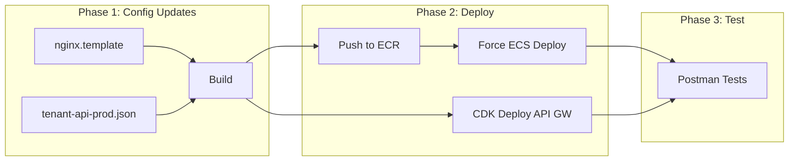

# Deploy Staff/Credentials/Leave APIs and Test

## Current State Analysis

| Route | NGINX | API Gateway | Status |

|-------|-------|-------------|--------|

| `/staff/*` | Returns 501 | Missing | NOT WORKING |

| `/school-years/*` | Missing | EXISTS | PARTIAL |

| `/credentials/*` | Missing | Missing | NOT WORKING |

## Deployment Architecture



---

## Phase 1: Configuration Updates

### 1.1 Update NGINX Configuration

**File:** [`server/application/reverseproxy/nginx.template`](server/application/reverseproxy/nginx.template)

**Changes:**

1. Replace `/staff` 501 placeholder (line 133-136) with routing:
```nginx
# Staff management: CRUD, credentials, leave (Identity Service)
location ~ ^/staff {
  if ($request_method !~ ^(GET|POST|HEAD|OPTIONS|PUT|PATCH|DELETE)$) {
    return 405;
  }
  proxy_pass http://identity-api.${NAMESPACE}.sc:3010;
  proxy_http_version 1.1;
  proxy_set_header Upgrade $http_upgrade;
  proxy_set_header Connection 'upgrade';
  proxy_set_header Host $host;
}
```

2. Add `/school-years` route (after line 102):
```nginx
# School years: tenant-wide academic year aggregation
location ~ ^/school-years {
  if ($request_method !~ ^(GET|POST|HEAD|OPTIONS|PUT|PATCH|DELETE)$) {
    return 405;
  }
  proxy_pass http://identity-api.${NAMESPACE}.sc:3010;
  proxy_http_version 1.1;
  proxy_set_header Upgrade $http_upgrade;
  proxy_set_header Connection 'upgrade';
  proxy_set_header Host $host;
}
```

3. Add `/credentials` route:
```nginx
# Credentials: expiring credentials lookup
location ~ ^/credentials {
  if ($request_method !~ ^(GET|POST|HEAD|OPTIONS|PUT|PATCH|DELETE)$) {
    return 405;
  }
  proxy_pass http://identity-api.${NAMESPACE}.sc:3010;
  proxy_http_version 1.1;
  proxy_set_header Upgrade $http_upgrade;
  proxy_set_header Connection 'upgrade';
  proxy_set_header Host $host;
}
```


### 1.2 Update API Gateway Configuration

**File:** [`server/lib/tenant-api-prod.json`](server/lib/tenant-api-prod.json)

Add staff routes following existing patterns (see `/schools` at line 375 for template).

**Routes to add:**

- `/staff` (GET, POST, OPTIONS)
- `/staff/{staffId}` (GET, PATCH, DELETE, OPTIONS)
- `/staff/{staffId}/employment-status` (PATCH, OPTIONS)
- `/staff/{staffId}/assignments` (POST, OPTIONS)
- `/staff/{staffId}/credentials` (GET, POST, OPTIONS)
- `/staff/{staffId}/credentials/{credentialId}` (GET, PATCH, DELETE, OPTIONS)
- `/staff/{staffId}/credentials/{credentialId}/verify` (PATCH, OPTIONS)
- `/staff/{staffId}/leave` (GET, POST, OPTIONS)
- `/staff/{staffId}/leave/{leaveId}` (GET, OPTIONS)
- `/staff/{staffId}/leave/{leaveId}/approve` (PATCH, OPTIONS)
- `/staff/{staffId}/leave/{leaveId}/reject` (PATCH, OPTIONS)
- `/staff/{staffId}/leave/{leaveId}/cancel` (PATCH, OPTIONS)
- `/staff/search/{term}` (GET, OPTIONS)
- `/credentials/expiring` (GET, OPTIONS)
- `/schools/{schoolId}/staff` (GET, POST, OPTIONS)

---

## Phase 2: Deployment Steps

### 2.1 Build and Push Docker Images

```bash
cd /Users/shoaibrain/edforge/scripts
AWS_PROFILE=dev ./build-application.sh
```

**Test:** Verify images pushed

```bash
AWS_PROFILE=dev aws ecr describe-images \
  --repository-name rproxy \
  --region us-east-1 \
  --query 'sort_by(imageDetails,& imagePushedAt)[-1].{pushed:imagePushedAt}'
```

### 2.2 Deploy ECS Services

```bash
# Deploy rproxy first (has NGINX config changes)
AWS_PROFILE=dev aws ecs update-service \
  --cluster prod-basic \
  --service rproxybasic \
  --force-new-deployment \
  --region us-east-1

# Deploy identity service (has the new modules)
AWS_PROFILE=dev aws ecs update-service \
  --cluster prod-basic \
  --service identitybasic \
  --force-new-deployment \
  --region us-east-1
```

**Test:** Monitor deployment

```bash
watch -n 5 "AWS_PROFILE=dev aws ecs describe-services \
  --cluster prod-basic \
  --services rproxybasic identitybasic \
  --region us-east-1 \
  --query 'services[*].{name:serviceName,running:runningCount,desired:desiredCount}'"
```

### 2.3 Deploy API Gateway (CDK)

```bash
cd /Users/shoaibrain/edforge/server
AWS_PROFILE=dev npx cdk deploy shared-infra-stack --require-approval=never
```

**Test:** Verify deployment

```bash
AWS_PROFILE=dev aws logs tail /ecs/rproxybasic --since 5m | tail -20
AWS_PROFILE=dev aws logs tail /ecs/identitybasic --since 5m | tail -20
```

---

## Phase 3: API Testing (Postman)

### Test Environment Setup

| Variable | Value |

|----------|-------|

| `baseUrl` | Get from CloudFormation output |

| `authToken` | From POST /auth/login |

| `tenantId` | Your test tenant ID |

| `schoolId` | From GET /schools |

| `staffId` | From POST /staff |

Get base URL:

```bash
AWS_PROFILE=dev aws cloudformation describe-stacks \
  --stack-name shared-infra-stack \
  --query "Stacks[0].Outputs[?OutputKey=='ApiGatewayUrl'].OutputValue" \
  --output text
```

### Test Sequence

#### Step 1: Authentication

```
POST {{baseUrl}}/auth/login
Body: { "username": "...", "password": "..." }
```

Save `token` to environment variable `authToken`.

#### Step 2: Get School (Pre-requisite)

```
GET {{baseUrl}}/schools
Headers: Authorization: Bearer {{authToken}}
```

Save first `schoolId` to environment.

#### Step 3: Staff CRUD

| # | Method | Endpoint | Body | Expected |

|---|--------|----------|------|----------|

| 3.1 | POST | `/staff` | See payload below | 201 + staffId |

| 3.2 | GET | `/staff` | - | 200 + list |

| 3.3 | GET | `/staff/{{staffId}}` | - | 200 + staff |

| 3.4 | PATCH | `/staff/{{staffId}}` | `{"phone":"555-999-0000"}` | 200 |

| 3.5 | GET | `/schools/{{schoolId}}/staff` | - | 200 + list |

**POST /staff payload:**

```json
{
  "firstName": "Jane",
  "lastName": "Smith",
  "email": "jane.smith@test-school.edu",
  "phone": "555-987-6543",
  "hireDate": "2026-01-15",
  "employmentType": "full_time",
  "employmentStatus": "active",
  "roles": [{
    "roleType": "teacher",
    "schoolId": "{{schoolId}}",
    "isPrimary": true,
    "department": "Mathematics",
    "startDate": "2026-01-15"
  }]
}
```

#### Step 4: Credentials

| # | Method | Endpoint | Body | Expected |

|---|--------|----------|------|----------|

| 4.1 | POST | `/staff/{{staffId}}/credentials` | See payload | 201 |

| 4.2 | GET | `/staff/{{staffId}}/credentials` | - | 200 |

| 4.3 | PATCH | `/staff/{{staffId}}/credentials/{{credId}}/verify` | `{"status":"verified"}` | 200 |

| 4.4 | GET | `/credentials/expiring?days=90` | - | 200 |

**POST credentials payload:**

```json
{
  "type": "teaching_license",
  "issuer": "Illinois State Board",
  "issueDate": "2025-08-01",
  "expirationDate": "2027-08-01",
  "status": "active"
}
```

#### Step 5: Leave Management

| # | Method | Endpoint | Body | Expected |

|---|--------|----------|------|----------|

| 5.1 | POST | `/staff/{{staffId}}/leave` | See payload | 201 |

| 5.2 | GET | `/staff/{{staffId}}/leave` | - | 200 |

| 5.3 | PATCH | `/staff/{{staffId}}/leave/{{leaveId}}/approve` | `{"approvedBy":"admin"}` | 200 |

**POST leave payload:**

```json
{
  "leaveType": "annual",
  "startDate": "2026-03-01",
  "endDate": "2026-03-05",
  "reason": "Family vacation"
}
```

#### Step 6: School Years (Already Working)

| # | Method | Endpoint | Expected |

|---|--------|----------|----------|

| 6.1 | GET | `/school-years` | 200 + list |

| 6.2 | GET | `/school-years/current` | 200 + current |

---

## Verification Checklist

After deployment, verify:

- [ ] `GET /health` returns 200
- [ ] `GET /schools` returns list
- [ ] `POST /staff` creates staff (201)
- [ ] `GET /staff` returns list (200)
- [ ] `GET /staff/{id}` returns staff (200)
- [ ] `POST /staff/{id}/credentials` creates credential (201)
- [ ] `POST /staff/{id}/leave` creates leave request (201)
- [ ] `GET /school-years` returns years (200)
- [ ] No 501 errors on `/staff` routes
- [ ] No 404 errors on `/school-years`

---

## Rollback Plan

If deployment fails:

```bash
# Check logs for errors
AWS_PROFILE=dev aws logs tail /ecs/identitybasic --since 10m

# Rollback to previous task definition
AWS_PROFILE=dev aws ecs update-service \
  --cluster prod-basic \
  --service identitybasic \
  --task-definition identity:PREVIOUS_REVISION \
  --force-new-deployment \
  --region us-east-1
```