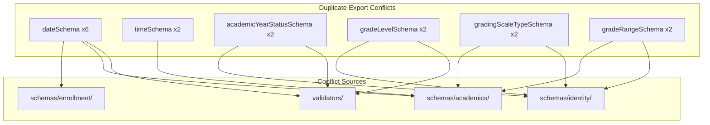
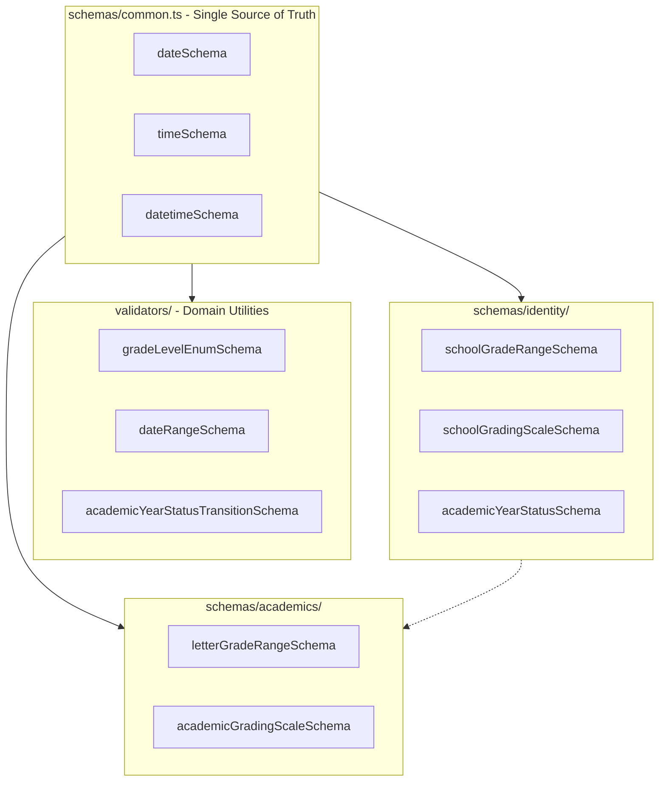

# Fix Duplicate Export Errors in shared-types Package

## Root Cause Analysis

The build fails with 14 errors due to **6 categories of duplicate exports**:



### Semantic Conflicts (Same Name, Different Purpose)

| Export Name | Location 1 | Purpose 1 | Location 2 | Purpose 2 |

|-------------|-----------|-----------|------------|-----------|

| `gradeLevelSchema` | validators/ | Enum `['PK','K','1'...]` | identity/department | Object `{letter,minScore,maxScore}` |

| `gradeRangeSchema` | identity/school | School grade range `{start,end}` | academics/grade | Grade letter range `{letter,min%,max%}` |

| `gradingScaleSchema` | identity/department | School config scale | academics/grade | Academic grading scale |

---

## Solution Architecture



---

## Phase 1: Consolidate Common Schemas

### 1.1 Add dateSchema and timeSchema to common.ts

Add to [`packages/shared-types/src/schemas/common.ts`](packages/shared-types/src/schemas/common.ts):

```typescript
// Add after isoDateSchema

/**
 * Date string in YYYY-MM-DD format
 */
export const dateSchema = z.string().regex(
  /^\d{4}-\d{2}-\d{2}$/,
  'Date must be in YYYY-MM-DD format'
).refine(
  (date) => !isNaN(Date.parse(date)),
  'Invalid date'
);

/**
 * Time string in HH:MM format (24-hour)
 */
export const timeSchema = z.string().regex(
  /^([0-1]?[0-9]|2[0-3]):[0-5][0-9]$/,
  'Time must be in HH:MM format (24-hour)'
);
```

### 1.2 Remove duplicate dateSchema from academics schemas

Remove local `dateSchema` definitions from:

- [`academics/student.schema.ts`](packages/shared-types/src/schemas/academics/student.schema.ts)
- [`academics/attendance.schema.ts`](packages/shared-types/src/schemas/academics/attendance.schema.ts)
- [`academics/grade.schema.ts`](packages/shared-types/src/schemas/academics/grade.schema.ts)
- [`academics/assignment.schema.ts`](packages/shared-types/src/schemas/academics/assignment.schema.ts)
- [`enrollment/enrollment.schema.ts`](packages/shared-types/src/schemas/enrollment/enrollment.schema.ts)

Import from common instead:

```typescript
import { dateSchema, timeSchema, ... } from '../common';
```

### 1.3 Remove duplicate timeSchema from academics

Remove local `timeSchema` from:

- [`academics/classroom.schema.ts`](packages/shared-types/src/schemas/academics/classroom.schema.ts)
- [`academics/attendance.schema.ts`](packages/shared-types/src/schemas/academics/attendance.schema.ts)

---

## Phase 2: Rename Conflicting Schemas in Identity Domain

### 2.1 Rename gradeRangeSchema in school.schema.ts

In [`identity/school.schema.ts`](packages/shared-types/src/schemas/identity/school.schema.ts):

```typescript
// Rename from gradeRangeSchema to schoolGradeRangeSchema
export const schoolGradeRangeSchema = z.object({
  start: z.string().min(1),
  end: z.string().min(1),
});
export type SchoolGradeRangeDto = z.infer<typeof schoolGradeRangeSchema>;
```

Update references in `createSchoolSchema` and `updateSchoolSchema`.

### 2.2 Rename gradeLevelSchema in department.schema.ts

In [`identity/department.schema.ts`](packages/shared-types/src/schemas/identity/department.schema.ts):

```typescript
// Rename from gradeLevelSchema to gradeLevelConfigSchema
export const gradeLevelConfigSchema = z.object({
  letter: z.string().min(1),
  minScore: z.number().int().min(0).max(100),
  maxScore: z.number().int().min(0).max(100),
  gpa: z.number().min(0).max(5).optional(),
});
export type GradeLevelConfigDto = z.infer<typeof gradeLevelConfigSchema>;

// Rename from gradingScaleSchema to schoolGradingScaleSchema
export const schoolGradingScaleSchema = z.object({
  type: gradingScaleTypeSchema,
  passingGrade: z.number().int().min(0).max(100),
  scale: z.array(gradeLevelConfigSchema),
});
export type SchoolGradingScaleDto = z.infer<typeof schoolGradingScaleSchema>;
```

---

## Phase 3: Rename Conflicting Schemas in Academics Domain

### 3.1 Rename gradeRangeSchema in grade.schema.ts

In [`academics/grade.schema.ts`](packages/shared-types/src/schemas/academics/grade.schema.ts):

```typescript
// Rename from gradeRangeSchema to letterGradeRangeSchema
export const letterGradeRangeSchema = z.object({
  letter: z.string().max(5),
  minPercentage: z.number().min(0).max(100),
  maxPercentage: z.number().min(0).max(100),
  gpaValue: z.number().min(0).max(5).optional(),
  description: z.string().max(100).optional(),
});
export type LetterGradeRangeDto = z.infer<typeof letterGradeRangeSchema>;

// Rename from gradingScaleSchema to academicGradingScaleSchema
export const academicGradingScaleSchema = z.object({
  name: z.string().min(1).max(100),
  scaleType: gradingScaleTypeSchema,
  ranges: z.array(letterGradeRangeSchema).min(1).max(20),
  passingGrade: z.number().min(0).max(100).default(60),
  isDefault: z.boolean().default(false),
});
export type AcademicGradingScaleDto = z.infer<typeof academicGradingScaleSchema>;
```

### 3.2 Rename gradingScaleTypeSchema to academicGradingScaleTypeSchema

```typescript
export const academicGradingScaleTypeSchema = z.enum([
  'percentage',
  'letter',
  'points',
  'standards_based',
  'pass_fail',
]);
export type AcademicGradingScaleType = z.infer<typeof academicGradingScaleTypeSchema>;
```

---

## Phase 4: Fix Validator Conflicts

### 4.1 Rename in validators/grade-level.ts

In [`validators/grade-level.ts`](packages/shared-types/src/validators/grade-level.ts):

```typescript
// Rename from gradeLevelSchema to gradeLevelEnumSchema
export const gradeLevelEnumSchema = z.enum(GRADE_LEVELS);

// Rename from gradeLevelRangeSchema to gradeLevelRangeValidatorSchema
export const gradeLevelRangeValidatorSchema = z.object({
  start: gradeLevelEnumSchema,
  end: gradeLevelEnumSchema,
});
```

### 4.2 Remove duplicate from validators/date-range.ts

Remove `dateSchema` from [`validators/date-range.ts`](packages/shared-types/src/validators/date-range.ts) and import from common:

```typescript
import { dateSchema } from '../schemas/common';
```

### 4.3 Rename in validators/academic-year.ts

In [`validators/academic-year.ts`](packages/shared-types/src/validators/academic-year.ts):

```typescript
// Keep constants and utilities, but remove duplicate schema
// Import the canonical schema from identity
import { academicYearStatusSchema } from '../schemas/identity/academic-year.schema';

// Re-export for convenience
export { academicYearStatusSchema };
export type AcademicYearStatusType = z.infer<typeof academicYearStatusSchema>;
```

---

## Phase 5: Update zod-dtos.ts in Academics Service

Update [`server/application/microservices/academics/src/common/dto/zod-dtos.ts`](server/application/microservices/academics/src/common/dto/zod-dtos.ts) to use renamed schemas:

```typescript
import {
  // Use renamed schemas
  academicGradingScaleSchema as createGradingScaleSchema,
  // ... etc
} from '@edforge/shared-types';
```

---

## Phase 6: Verify and Build

Run the build to verify all conflicts are resolved:

```bash
cd packages/shared-types && npm run build
```

---

## Files to Modify

| File | Changes |

|------|---------|

| `schemas/common.ts` | Add `dateSchema`, `timeSchema` |

| `schemas/identity/school.schema.ts` | Rename `gradeRangeSchema` to `schoolGradeRangeSchema` |

| `schemas/identity/department.schema.ts` | Rename `gradeLevelSchema`, `gradingScaleSchema` |

| `schemas/academics/student.schema.ts` | Remove local `dateSchema`, import from common |

| `schemas/academics/classroom.schema.ts` | Remove local `timeSchema`, import from common |

| `schemas/academics/attendance.schema.ts` | Remove local `dateSchema`, `timeSchema` |

| `schemas/academics/grade.schema.ts` | Remove local `dateSchema`, rename grading schemas |

| `schemas/academics/assignment.schema.ts` | Remove local `dateSchema` |

| `schemas/enrollment/enrollment.schema.ts` | Remove local `dateSchema` |

| `validators/date-range.ts` | Remove local `dateSchema`, import from common |

| `validators/grade-level.ts` | Rename `gradeLevelSchema` to `gradeLevelEnumSchema` |

| `validators/academic-year.ts` | Remove duplicate, import from identity |

| Backend `zod-dtos.ts` | Update to use renamed schemas |

---

## Ed-Fi Compliance Preparation

This architecture supports future Ed-Fi integration by:

1. **Clear domain separation**: Identity (school config) vs Academics (student grading)
2. **Extensible grading schemas**: `academicGradingScaleSchema` can be extended with Ed-Fi fields
3. **Standards-based grading**: Already includes `standards_based` in grading scale types
4. **Canonical date/time formats**: Consistent with Ed-Fi data exchange requirements