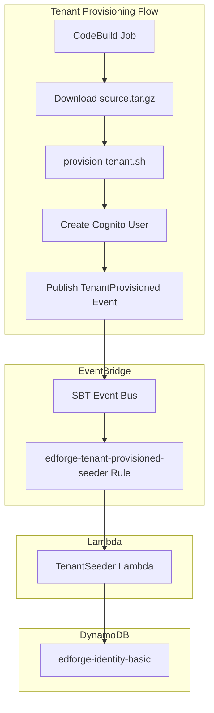

# Fix EventBridge Tenant Sync Integration

## Root Cause

The updated `provision-tenant.sh` with EventBridge event publishing code exists locally but was **never uploaded to S3**. The provisioning flow downloads `source.tar.gz` from S3 and executes the OLD script without the EventBridge code.

## Fix Required

### Step 1: Upload Updated Provision Script to S3

Run the update script to package and upload the server folder (including the updated `provision-tenant.sh`):

```bash
cd /Users/shoaibrain/edforge/scripts/utils
chmod +x update-provision-source.sh
AWS_PROFILE=dev ./update-provision-source.sh
```

This will:

- Package `server/` folder into `source.tar.gz`
- Upload to S3 bucket `saas-reference-architecture-ecs-{account}-{region}`
- The updated `provision-tenant.sh` with EventBridge code will now be used for future provisioning

### Step 2: Fix Existing Tenant (Missing METADATA)

The tenant `8f26e3af-9263-47a1-895d-41e10a679954` is missing its METADATA record. Seed it manually:

```bash
cd /Users/shoaibrain/edforge/server/lib/provision-scripts

# Update the seed script for the new tenant
TENANT_ID="8f26e3af-9263-47a1-895d-41e10a679954" \
TENANT_NAME="advanced" \
SUBDOMAIN="advanced" \
EMAIL="shoaib.rain@outlook.com" \
TIER="BASIC" \
AWS_PROFILE=dev ./seed-existing-tenant.sh
```

### Step 3: Comprehensive Validation Tests

#### Test A: Verify Lambda + EventBridge Rule Configuration

1. Check EventBridge rule is enabled and listening to correct event bus
2. Verify Lambda has correct IAM permissions for DynamoDB
3. Confirm event pattern matches `source: edforge.provisioning`, `detail-type: TenantProvisioned`

#### Test B: Manual Event Test (Lambda Invocation)

Test the Lambda with the NEW tenant data:

```json
{
  "source": "edforge.provisioning",
  "detail-type": "TenantProvisioned",
  "detail": {
    "tenantId": "8f26e3af-9263-47a1-895d-41e10a679954",
    "tenantName": "advanced",
    "tier": "BASIC",
    "email": "shoaib.rain@outlook.com",
    "subdomain": "advanced",
    "cognitoUserPoolId": "us-east-1_Ituu6vuqD",
    "timestamp": "2026-01-12T04:00:00.000Z"
  }
}
```

Expected: Lambda logs show "Tenant metadata seeded successfully" or "already exists"

#### Test C: Verify DynamoDB Record

```bash
AWS_PROFILE=dev aws dynamodb get-item \
  --table-name edforge-identity-basic \
  --key '{"tenantId": {"S": "8f26e3af-9263-47a1-895d-41e10a679954"}, "entityKey": {"S": "METADATA"}}' \
  --region us-east-1
```

Expected: Returns TENANT metadata with `entityType: TENANT`, `status: active`

#### Test D: API Verification

```bash
# Get fresh JWT token for the new tenant, then:
curl -X GET "https://f3xlvrqt24.execute-api.us-east-1.amazonaws.com/prod/tenants/8f26e3af-9263-47a1-895d-41e10a679954" \
  -H "Authorization: Bearer {JWT_TOKEN}"
```

Expected: HTTP 200 with tenant metadata

#### Test E: End-to-End Provisioning Test (Optional)

Provision a NEW test tenant via AdminWeb/Control Plane and verify:

1. CodeBuild logs show "Published TenantProvisioned event"
2. Lambda CloudWatch logs show event received
3. DynamoDB has METADATA record immediately after provisioning
4. GET /tenants/{tenantId} returns 200

---

## File Reference

| File | Purpose |

|------|---------|

| [`scripts/utils/update-provision-source.sh`](scripts/utils/update-provision-source.sh) | Packages and uploads server folder to S3 |

| [`server/lib/provision-scripts/provision-tenant.sh`](server/lib/provision-scripts/provision-tenant.sh) | Provisioning script with EventBridge code (lines 145-191) |

| [`server/lib/provision-scripts/seed-existing-tenant.sh`](server/lib/provision-scripts/seed-existing-tenant.sh) | One-time seed script for existing tenants |

| [`server/lib/shared-infra/tenant-seeder-lambda.ts`](server/lib/shared-infra/tenant-seeder-lambda.ts) | Lambda construct for tenant seeding |

---

## Architecture After Fix

