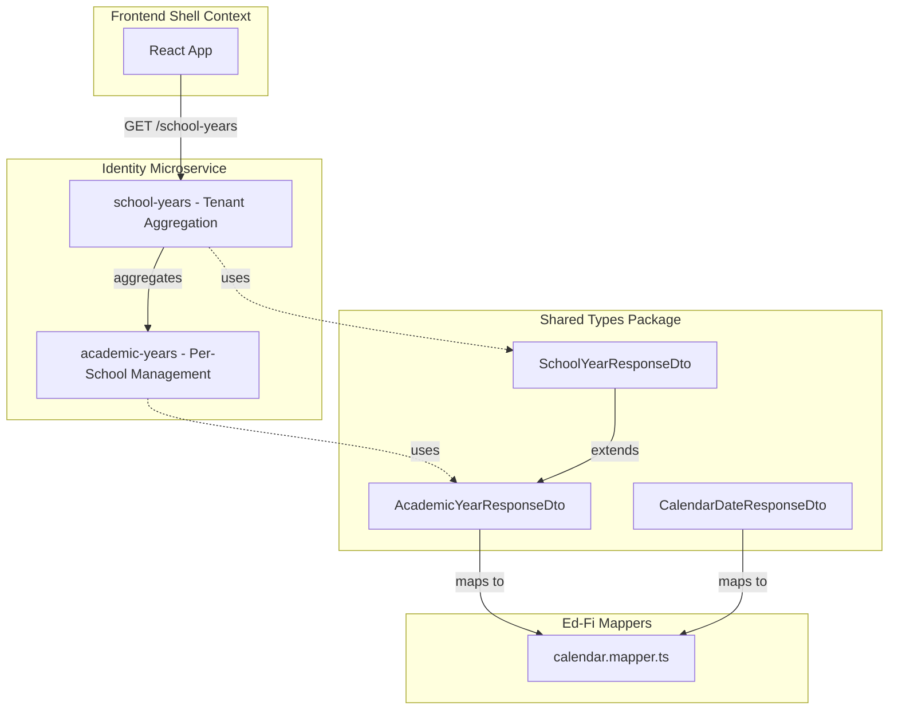

# Fix School-Years Module with Proper Shared Types

## Problem Summary

The `school-years` module uses hardcoded inline DTOs instead of importing from `@edforge/shared-types`:

```typescript
// Current - Hardcoded in school-years.service.ts (lines 25-38)
export interface SchoolYearDto {
  yearId: string;
  schoolId: string;
  schoolName: string;  // Added field for aggregation
  name: string;
  ...
}
```

Meanwhile, `academic-years` properly uses shared types:

```typescript
// Correct pattern in academic-years.service.ts (lines 29-36)
import type {
  CreateAcademicYearDto,
  UpdateAcademicYearDto,
  AcademicYearResponseDto,
  ...
} from '@edforge/shared-types';
```

## Implementation Plan

### Phase 1: Create School Year Aggregation Schema

Create a new schema in [`packages/shared-types/src/schemas/identity/school-year.schema.ts`](packages/shared-types/src/schemas/identity/school-year.schema.ts):

```typescript
// School Year Response - Extends AcademicYearResponseDto with school context
export const schoolYearResponseSchema = academicYearResponseSchema.extend({
  schoolName: z.string(),
});

export const schoolYearListResponseSchema = z.object({
  items: z.array(schoolYearResponseSchema),
  total: z.number().int(),
});
```

### Phase 2: Export Missing Calendar Schemas

Update [`packages/shared-types/src/schemas/identity/index.ts`](packages/shared-types/src/schemas/identity/index.ts) to export the bell-schedule and calendar-date schemas that were created earlier but not exported:

```typescript
// Calendar Management (Ed-Fi aligned)
export * from './bell-schedule.schema';
export * from './calendar-date.schema';
export * from './school-year.schema';
```

### Phase 3: Update School-Years Module

Update [`server/application/microservices/identity/src/school-years/school-years.service.ts`](server/application/microservices/identity/src/school-years/school-years.service.ts):

1. Remove hardcoded `SchoolYearDto` and `SchoolYearsListDto` interfaces
2. Import types from `@edforge/shared-types`
3. Update response mapping to use schema types

### Phase 4: Add Ed-Fi Calendar Mapper

Create [`packages/shared-types/src/mappers/edfi/calendar.mapper.ts`](packages/shared-types/src/mappers/edfi/calendar.mapper.ts) for future Ed-Fi compliance export:

- Map `AcademicYearResponseDto` to Ed-Fi `Calendar` resource
- Map `CalendarDateResponseDto` to Ed-Fi `CalendarDate` resource
- Map `GradingPeriodResponseDto` to Ed-Fi grading period structures

## Files to Modify

| File | Change |

|------|--------|

| `packages/shared-types/src/schemas/identity/school-year.schema.ts` | NEW - Create aggregation schema |

| `packages/shared-types/src/schemas/identity/index.ts` | Export new calendar and school-year schemas |

| `packages/shared-types/src/mappers/edfi/calendar.mapper.ts` | NEW - Ed-Fi calendar mapper |

| `packages/shared-types/src/mappers/edfi/index.ts` | Export calendar mapper |

| `server/.../school-years/school-years.service.ts` | Use shared types, remove hardcoded DTOs |

| `server/.../school-years/school-years.controller.ts` | Update response type imports |

## Architecture Alignment



## Ed-Fi Alignment

The Ed-Fi calendar domain includes:

- `Calendar` - Maps from `AcademicYear` (calendar type, school year range)
- `CalendarDate` - Maps from our `CalendarDate` entity (instructional days, events)
- `CalendarGradeLevel` - Grade levels associated with calendar

This implementation positions EdForge for future Ed-Fi certification without breaking current functionality.