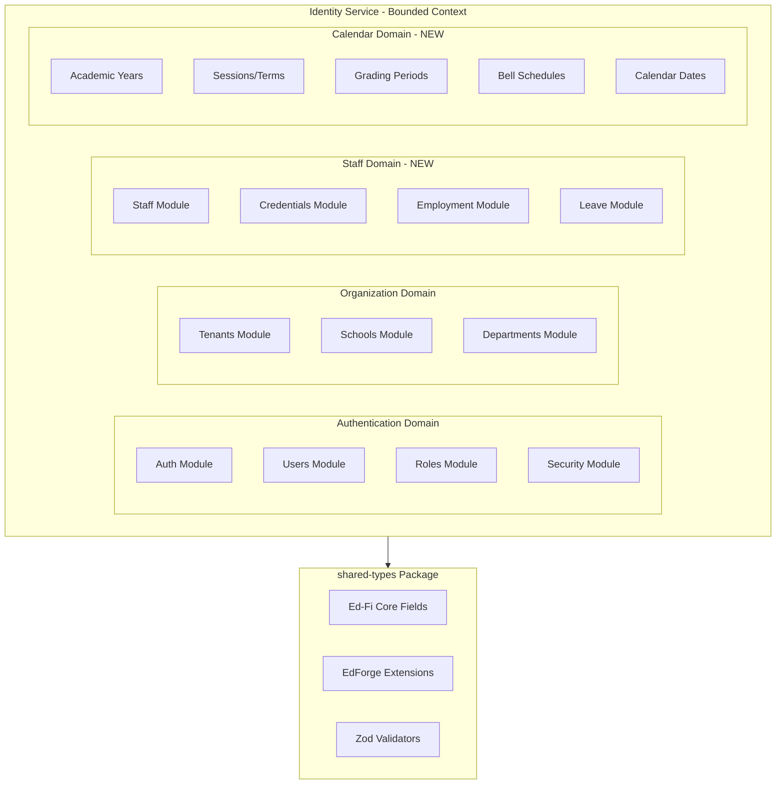

# Identity Service Enhancement for EdForge MVP

## Architecture Overview

The Identity service will evolve into the **Core Foundation Service** for EdForge EMIS, managing all organizational entities while maintaining authentication/authorization capabilities.



## DynamoDB Data Model Strategy

Using single-table design with composite keys and GSIs for complex query patterns:

| Entity | PK | SK | GSI1-PK | GSI1-SK | GSI2-PK | GSI2-SK |

|--------|----|----|---------|---------|---------|---------|

| Staff | TENANT#tid | STAFF#staffId | SCHOOL#schoolId | STAFF#staffId | EMAIL#email | STAFF#staffId |

| StaffAssignment | TENANT#tid | STAFF#staffId#ASSIGN#assignId | SCHOOL#schoolId | STAFFASSIGN#date | - | - |

| Credential | TENANT#tid | STAFF#staffId#CRED#credId | CREDTYPE#type | EXPIRY#date | - | - |

| Leave | TENANT#tid | STAFF#staffId#LEAVE#leaveId | SCHOOL#schoolId | LEAVE#startDate | - | - |

| BellSchedule | TENANT#tid | SCHOOL#schoolId#BELL#scheduleId | - | - | - | - |

| GradingPeriod | TENANT#tid | SCHOOL#schoolId#GRADE#periodId | ACADYEAR#yearId | GRADEPERIOD#seq | - | - |

| CalendarDate | TENANT#tid | SCHOOL#schoolId#DATE#date | ACADYEAR#yearId | CALDATE#date | - | - |

---

## Phase 1: Shared Types - Ed-Fi Hybrid Schemas (Week 1)

### 1.1 Staff Zod Schemas with Ed-Fi Core Fields

Create [`packages/shared-types/src/schemas/identity/staff.schema.ts`](packages/shared-types/src/schemas/identity/staff.schema.ts):

```typescript
// Ed-Fi aligned core fields + EdForge extensions
export const staffSchema = z.object({
  // Ed-Fi Core Fields
  staffUniqueId: z.string().min(1).max(50),          // Ed-Fi: staffUniqueId
  firstName: z.string().min(1).max(75),               // Ed-Fi: firstName
  lastSurname: z.string().min(1).max(75),             // Ed-Fi: lastSurname
  middleName: z.string().max(75).optional(),          // Ed-Fi: middleName
  birthDate: dateSchema.optional(),                   // Ed-Fi: birthDate
  hispanicLatinoEthnicity: z.boolean().optional(),    // Ed-Fi compliance
  highlyQualifiedTeacher: z.boolean().optional(),     // Ed-Fi compliance
  
  // EdForge Extensions
  staffId: z.string().uuid(),                         // Internal ID
  schoolId: z.string().uuid(),                        // Primary school
  tenantId: z.string().uuid(),
  email: emailSchema,
  phone: z.string().optional(),
  role: staffRoleSchema,                              // teacher, admin, support, principal
  employmentStatus: employmentStatusSchema,           // active, onLeave, terminated
  hireDate: dateSchema,
  department: z.string().optional(),
  title: z.string().max(100).optional(),
  
  // Metadata
  status: z.enum(['active', 'inactive', 'pending']),
  createdAt: isoDateSchema,
  updatedAt: isoDateSchema,
});
```

### 1.2 Credential Schema (Ed-Fi Aligned)

```typescript
export const credentialSchema = z.object({
  // Ed-Fi Core
  credentialIdentifier: z.string(),                   // Ed-Fi: credentialIdentifier
  credentialTypeDescriptor: z.string(),               // Ed-Fi: credentialTypeDescriptor
  issuanceDate: dateSchema,                           // Ed-Fi: issuanceDate
  expirationDate: dateSchema.optional(),              // Ed-Fi: expirationDate
  credentialFieldDescriptor: z.string().optional(),   // Ed-Fi: credentialFieldDescriptor
  
  // EdForge Extensions
  credentialId: z.string().uuid(),
  staffId: z.string().uuid(),
  issuingAuthority: z.string(),
  verificationStatus: z.enum(['pending', 'verified', 'expired', 'revoked']),
  documentUrl: z.string().url().optional(),
});
```

### 1.3 Calendar Schemas (Ed-Fi Aligned)

```typescript
// Bell Schedule (Ed-Fi aligned)
export const bellScheduleSchema = z.object({
  bellScheduleName: z.string().min(1).max(60),        // Ed-Fi: bellScheduleName
  alternateDayName: z.string().optional(),            // Ed-Fi: alternateDayName
  totalInstructionalTime: z.number().optional(),      // Ed-Fi: totalInstructionalTime
  
  // EdForge Extensions  
  bellScheduleId: z.string().uuid(),
  schoolId: z.string().uuid(),
  classPeriods: z.array(classPeriodSchema),
  isDefault: z.boolean().default(false),
  effectiveDate: dateSchema,
  endDate: dateSchema.optional(),
});

// Grading Period (Ed-Fi aligned)
export const gradingPeriodSchema = z.object({
  gradingPeriodDescriptor: z.string(),                // Ed-Fi: gradingPeriodDescriptor
  periodSequence: z.number().int().min(1),            // Ed-Fi: periodSequence
  beginDate: dateSchema,                              // Ed-Fi: beginDate
  endDate: dateSchema,                                // Ed-Fi: endDate
  totalInstructionalDays: z.number().int(),           // Ed-Fi: totalInstructionalDays
  
  // EdForge Extensions
  gradingPeriodId: z.string().uuid(),
  schoolId: z.string().uuid(),
  academicYearId: z.string().uuid(),
  name: z.string().max(60),
  gradesDueDate: dateSchema.optional(),
  reportCardsDate: dateSchema.optional(),
});
```

---

## Phase 2: Identity Service - Staff Module (Week 2-3)

### 2.1 Entity Definitions

Create [`server/application/microservices/identity/src/common/entities/staff.entity.ts`](server/application/microservices/identity/src/common/entities/staff.entity.ts):

```typescript
export interface Staff extends BaseEntity {
  entityType: 'STAFF';
  staffId: string;
  staffUniqueId: string;  // Ed-Fi unique ID (state ID, employee number)
  
  // Ed-Fi Core Demographics
  firstName: string;
  lastSurname: string;
  middleName?: string;
  birthDate?: string;
  
  // EdForge Fields
  email: string;
  phone?: string;
  primarySchoolId: string;
  schoolAssignments: StaffSchoolAssignment[];
  role: StaffRole;
  employmentStatus: EmploymentStatus;
  hireDate: string;
  terminationDate?: string;
  department?: string;
  title?: string;
  
  // Ed-Fi Compliance Fields (for future export)
  hispanicLatinoEthnicity?: boolean;
  highlyQualifiedTeacher?: boolean;
}
```

### 2.2 Staff Service Implementation

Create [`server/application/microservices/identity/src/staff/staff.service.ts`](server/application/microservices/identity/src/staff/staff.service.ts):

Key methods:

- `createStaff()` - Create staff with school assignment
- `getStaff()` - Get by staffId
- `listStaffBySchool()` - Query GSI1 for school's staff
- `assignToSchool()` - Multi-school assignment
- `updateEmploymentStatus()` - Status transitions with audit
- `searchStaff()` - Search by name, email, role

### 2.3 Credentials Module

Create [`server/application/microservices/identity/src/credentials/`](server/application/microservices/identity/src/credentials/):

- `credentials.service.ts` - CRUD for credentials with expiration tracking
- `credentials.controller.ts` - REST endpoints
- Background job for expiration notifications

### 2.4 Leave Module

Create [`server/application/microservices/identity/src/leave/`](server/application/microservices/identity/src/leave/):

- `leave.service.ts` - Leave requests, approvals, balance tracking
- Integration with calendar for substitute planning

---

## Phase 3: Identity Service - Calendar Module (Week 3-4)

### 3.1 Enhanced Calendar Entities

Extend [`server/application/microservices/identity/src/common/entities/`](server/application/microservices/identity/src/common/entities/):

```typescript
// bell-schedule.entity.ts
export interface BellSchedule extends BaseEntity {
  entityType: 'BELLSCHEDULE';
  bellScheduleId: string;
  schoolId: string;
  bellScheduleName: string;
  classPeriods: ClassPeriod[];
  totalInstructionalTime: number;
  isDefault: boolean;
  effectiveDate: string;
}

// grading-period.entity.ts  
export interface GradingPeriod extends BaseEntity {
  entityType: 'GRADINGPERIOD';
  gradingPeriodId: string;
  schoolId: string;
  academicYearId: string;
  gradingPeriodDescriptor: string;
  periodSequence: number;
  name: string;
  beginDate: string;
  endDate: string;
  totalInstructionalDays: number;
}

// calendar-date.entity.ts
export interface CalendarDate extends BaseEntity {
  entityType: 'CALENDARDATE';
  schoolId: string;
  date: string;  // YYYY-MM-DD
  calendarEvents: CalendarEvent[];  // Ed-Fi aligned
  isInstructionalDay: boolean;
  isHoliday: boolean;
  bellScheduleId?: string;  // Which schedule applies
}
```

### 3.2 Calendar Service Implementation

Create [`server/application/microservices/identity/src/calendar/`](server/application/microservices/identity/src/calendar/):

- `bell-schedules.service.ts` - Period definitions, schedule management
- `grading-periods.service.ts` - Term/semester grading periods
- `calendar-dates.service.ts` - Day-by-day calendar with events
- `calendar.controller.ts` - Unified calendar endpoints

Key features:

- Auto-generate calendar dates from academic year
- Bell schedule assignment by day type
- Instructional days calculation for compliance

---

## Phase 4: API Design (REST + Future GraphQL Ready)

### Staff API Endpoints

```
POST   /api/v1/schools/:schoolId/staff           - Create staff
GET    /api/v1/schools/:schoolId/staff           - List school staff
GET    /api/v1/staff/:staffId                    - Get staff details
PATCH  /api/v1/staff/:staffId                    - Update staff
DELETE /api/v1/staff/:staffId                    - Deactivate staff

POST   /api/v1/staff/:staffId/credentials        - Add credential
GET    /api/v1/staff/:staffId/credentials        - List credentials
PATCH  /api/v1/staff/:staffId/credentials/:id    - Update credential

POST   /api/v1/staff/:staffId/leave              - Request leave
GET    /api/v1/staff/:staffId/leave              - Leave history
PATCH  /api/v1/leave/:leaveId/approve            - Approve leave
```

### Calendar API Endpoints

```
POST   /api/v1/schools/:schoolId/bell-schedules       - Create schedule
GET    /api/v1/schools/:schoolId/bell-schedules       - List schedules
PATCH  /api/v1/bell-schedules/:scheduleId             - Update schedule

POST   /api/v1/schools/:schoolId/grading-periods      - Create grading period
GET    /api/v1/schools/:schoolId/grading-periods      - List by academic year
PATCH  /api/v1/grading-periods/:periodId              - Update period

GET    /api/v1/schools/:schoolId/calendar             - Get calendar dates
PATCH  /api/v1/schools/:schoolId/calendar/:date       - Update specific date
POST   /api/v1/schools/:schoolId/calendar/generate    - Generate from academic year
```

---

## Implementation Priority for 50 Pilot Schools

| Priority | Module | Rationale |

|----------|--------|-----------|

| P0 | Staff CRUD + School Assignment | Teachers needed for classroom/section assignment |

| P0 | Bell Schedules | Required for class scheduling |

| P1 | Grading Periods | Required for gradebook |

| P1 | Credentials (Basic) | Teacher certification tracking |

| P2 | Calendar Dates | Attendance tracking, instructional days |

| P2 | Leave Management | Staff availability |

| P3 | Employment History | HR compliance |

| P3 | Ed-Fi Export Mappers | State reporting |

---

## Ed-Fi Compliance Mapping Layer

For future Ed-Fi data exchange, create mapper utilities:

```typescript
// packages/shared-types/src/mappers/edfi/staff.mapper.ts
export function toEdFiStaff(staff: StaffDto): EdFiStaff {
  return {
    staffUniqueId: staff.staffUniqueId,
    firstName: staff.firstName,
    lastSurname: staff.lastSurname,
    middleName: staff.middleName,
    birthDate: staff.birthDate,
    hispanicLatinoEthnicity: staff.hispanicLatinoEthnicity,
    highlyQualifiedTeacher: staff.highlyQualifiedTeacher,
    // Map addresses, credentials, etc.
  };
}
```

This deferred mapping approach allows EdForge to operate efficiently while maintaining Ed-Fi compliance capability for state reporting.

---

## File Structure After Implementation

```
server/application/microservices/identity/src/
├── auth/                    # Existing
├── users/                   # Existing  
├── roles/                   # Existing
├── schools/                 # Existing
├── academic-years/          # Existing
├── sessions/                # Existing
├── staff/                   # NEW
│   ├── staff.module.ts
│   ├── staff.controller.ts
│   ├── staff.service.ts
│   └── dto/
├── credentials/             # NEW
│   ├── credentials.module.ts
│   ├── credentials.controller.ts
│   └── credentials.service.ts
├── leave/                   # NEW
│   ├── leave.module.ts
│   ├── leave.controller.ts
│   └── leave.service.ts
├── calendar/                # NEW - Enhanced
│   ├── bell-schedules/
│   ├── grading-periods/
│   ├── calendar-dates/
│   └── calendar.module.ts
└── common/
    └── entities/
        ├── staff.entity.ts           # NEW
        ├── credential.entity.ts      # NEW
        ├── leave.entity.ts           # NEW
        ├── bell-schedule.entity.ts   # NEW
        ├── grading-period.entity.ts  # NEW
        └── calendar-date.entity.ts   # NEW
```