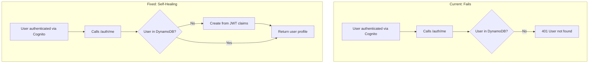

# Identity Service Self-Healing User Sync

## Staff Engineer Analysis

### The Insight

The `login()` method in [auth.service.ts](server/application/microservices/identity/src/auth/auth.service.ts) already has the correct pattern (lines 123-151):

```typescript
if (!user) {
  // Create user record in DynamoDB (first login)
  user = { ...extract from Cognito/JWT... };
  await this.dynamoDBClient.putItem(client, user);
  await this.dynamoDBClient.putItem(client, preferences);
}
```

The gap is that `getCurrentUser()` throws 401 instead of applying this same pattern.

### Why This Is The Right Approach



**Benefits**:

- Zero new infrastructure (no Lambda, no EventBridge)
- Self-healing - any authenticated user auto-syncs
- Follows existing pattern already proven in `login()`
- Uses `getSystemClient()` - appropriate for bootstrap operations
- All required data is in JWT claims (already validated by API Gateway Authorizer)

### The JWT Claims Available

From Cognito, the JWT contains everything needed:| JWT Claim | Maps To | Available in RequestContext ||-----------|---------|---------------------------|| `sub` | userId | `context.userId` || `custom:tenantId` | tenantId | `context.tenantId` || `email` | email | `context.email` || `custom:userRole` | globalRole | `context.globalRole` || `cognito:username` | cognitoUsername | Need to add |

### Why NOT Lambda Trigger

| Aspect | Lambda Trigger | Self-Healing in Service ||--------|---------------|------------------------|| Infrastructure | New Lambda + IAM + triggers | None || Cold starts | Yes | No || Failure handling | Complex retry logic | Simple - next request works || Cognito dependency | Tight coupling | Loose coupling || Testing | Requires full stack | Unit testable || sbt-aws alignment | Over-engineering | Follows reference pattern |

## Implementation

### Single File Change

**File**: [server/application/microservices/identity/src/auth/auth.service.ts](server/application/microservices/identity/src/auth/auth.service.ts)**Change**: Update `getCurrentUser()` to create user if not found (same pattern as `login()`):

```typescript
async getCurrentUser(context: RequestContext): Promise<CurrentUserResponseDto> {
  const client = this.dynamoDBClient.getSystemClient();

  // Get user
  let user = await this.dynamoDBClient.getItem<User>(
    client,
    context.tenantId,
    EntityKeyBuilder.user(context.userId)
  );

  // Self-healing: Create user from JWT claims if not in DynamoDB
  if (!user) {
    this.logger.log(`Auto-creating user from JWT: ${context.email} (${context.userId})`);
    
    const now = new Date().toISOString();
    user = {
      tenantId: context.tenantId,
      entityKey: EntityKeyBuilder.user(context.userId),
      entityType: 'USER',
      userId: context.userId,
      email: context.email,
      cognitoUsername: context.email, // Use email as username identifier
      cognitoSub: context.userId,
      firstName: '', // Will be populated on profile update
      lastName: '',
      globalRole: context.globalRole,
      status: 'active',
      gsi1pk: GSIKeyBuilder.emailLookup(context.email),
      gsi1sk: `TENANT#${context.tenantId}`,
      createdAt: now,
      createdBy: context.userId,
      updatedAt: now,
      updatedBy: context.userId,
      version: 1,
    };
    await this.dynamoDBClient.putItem(client, user);

    // Create default preferences
    const preferences = createDefaultPreferences(context.tenantId, context.userId, context.userId);
    await this.dynamoDBClient.putItem(client, preferences);
  }

  // ... rest of existing method unchanged ...
}
```


### Optional Enhancement: Add `cognitoUsername` to RequestContext

To capture the actual Cognito username (which may differ from email for admin-created users), update the JWT extraction middleware to include `cognito:username` claim.**File**: Wherever JWT claims are extracted to populate RequestContext (likely in a guard or middleware).

## What NOT To Change

- **No new Lambda** - Cognito triggers add complexity
- **No EventBridge events** - Overkill for user sync
- **No provisioning script changes** - Let service handle sync
- **No ABAC policy changes** - Current `getSystemClient()` approach is correct for bootstrap

## Testing

After implementation, the test flow:

1. User authenticates via Cognito (already works)
2. User calls `GET /auth/me` with valid JWT
3. Service creates user in DynamoDB if not exists
4. Returns user profile

The existing [identity-test.sh](scripts/identity-test.sh) can validate this works correctly.

## Alignment with sbt-aws Pattern

The AWS SaaS Reference Solution's user service uses Cognito as the source of truth. EdForge extends this with DynamoDB for richer user profiles. The self-healing pattern: