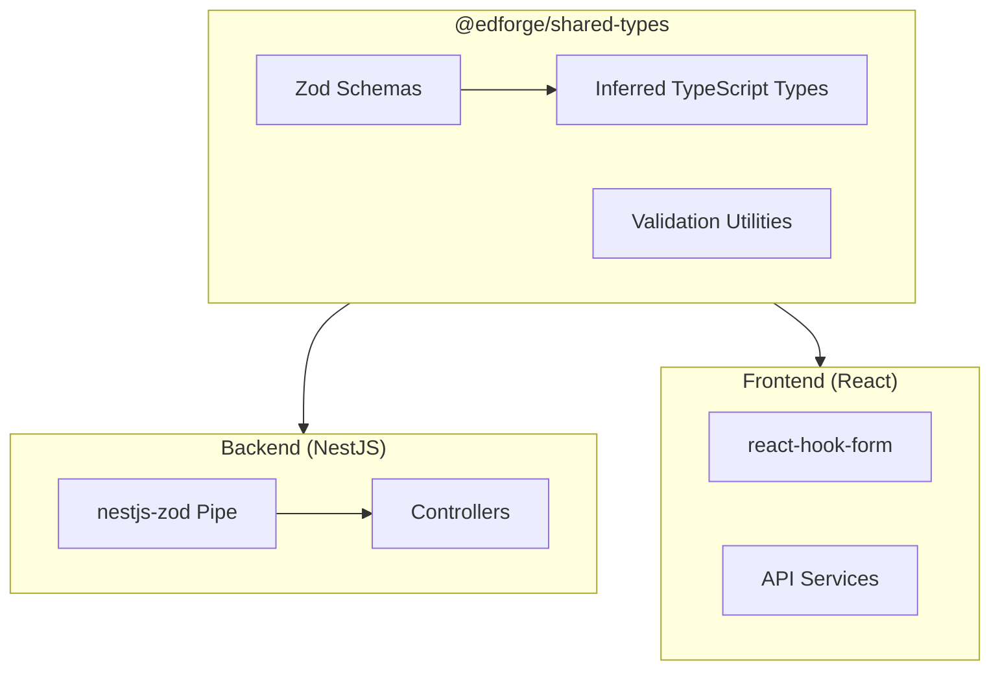

# Zod-Based Shared Data Objects Package

## Architecture Overview



## Key Changes

### 1. Update Package Configuration

Update [`packages/shared-types/package.json`](packages/shared-types/package.json):

- Add `zod` as a dependency (runtime, not dev)
- Remove `openapi-typescript` dependency
- Remove OpenAPI generation scripts
- Update build to simple TypeScript compilation

### 2. Create Zod Schema Structure

Reorganize `packages/shared-types/src/` into domain-based schema files:

```javascript
src/
├── index.ts                    # Main exports
├── schemas/
│   ├── index.ts               # Re-export all schemas
│   ├── common.ts              # Base schemas (pagination, errors)
│   ├── identity/
│   │   ├── index.ts
│   │   ├── user.schema.ts     # User DTOs
│   │   ├── auth.schema.ts     # Auth DTOs  
│   │   ├── security.schema.ts # Security DTOs (with Cognito password rules)
│   │   ├── tenant.schema.ts
│   │   ├── school.schema.ts
│   │   ├── role.schema.ts
│   │   ├── session.schema.ts
│   │   └── academic-year.schema.ts
│   └── academics/
│       └── ... (future)
├── types/
│   └── index.ts               # Re-export inferred types
└── validators/
    └── password.ts            # Cognito password validation
```

### 3. Cognito Password Validation (Critical)

From [`server/lib/tenant-template/identity-provider.ts`](server/lib/tenant-template/identity-provider.ts), the Cognito password policy is:

```typescript
passwordPolicy: {
  minLength: 8,
  requireLowercase: true,
  requireUppercase: true,
  requireDigits: true,
  requireSymbols: true  // Cognito default symbols
}
```

Create password schema in `src/validators/password.ts`:

```typescript
import { z } from 'zod';

// Cognito's allowed special characters
const COGNITO_SPECIAL_CHARS = /[\\^$*.\\[\\]{}()?\"!@#%&/\\\\,><':;|_~`+=\\-]/;

export const passwordSchema = z.string()
  .min(8, 'Password must be at least 8 characters')
  .max(128, 'Password must be at most 128 characters')
  .regex(/[a-z]/, 'Password must contain at least one lowercase letter')
  .regex(/[A-Z]/, 'Password must contain at least one uppercase letter')
  .regex(/[0-9]/, 'Password must contain at least one digit')
  .regex(COGNITO_SPECIAL_CHARS, 'Password must contain at least one special character');

export const COGNITO_PASSWORD_REQUIREMENTS = {
  minLength: 8,
  maxLength: 128,
  requireLowercase: true,
  requireUppercase: true,
  requireDigits: true,
  requireSymbols: true,
  allowedSymbols: `^ $ * . [ ] { } ( ) ? " ! @ # % & / \\ , > < ' : ; | _ ~ \` + = -`,
} as const;
```

### 4. Example Schema Pattern

Example for `src/schemas/identity/user.schema.ts`:

```typescript
import { z } from 'zod';

// Address schema (reusable)
export const addressSchema = z.object({
  street: z.string().optional(),
  street2: z.string().optional(),
  city: z.string().optional(),
  state: z.string().optional(),
  postalCode: z.string().optional(),
  country: z.string().optional(),
});

// Update User DTO schema
export const updateUserSchema = z.object({
  firstName: z.string().min(1).max(50).optional(),
  lastName: z.string().min(1).max(50).optional(),
  middleName: z.string().max(50).optional(),
  displayName: z.string().max(100).optional(),
  phone: z.string().regex(/^\+?[1-9]\d{1,14}$/).optional(),
  avatarUrl: z.string().url().optional(),
  address: addressSchema.optional(),
  status: z.enum(['active', 'inactive', 'suspended']).optional(),
});

// Infer TypeScript types from schemas
export type UpdateUserDto = z.infer<typeof updateUserSchema>;
export type UserAddressDto = z.infer<typeof addressSchema>;
```

### 5. Backend Integration

Install `nestjs-zod` in the backend and create a global validation pipe:

```typescript
// In main.ts
import { ZodValidationPipe } from 'nestjs-zod';
app.useGlobalPipes(new ZodValidationPipe());
```

Replace DTOs with schema imports:

```typescript
// Before (in controller)
import { UpdateUserDto } from '../common/dto/user.dto';

// After
import { updateUserSchema, UpdateUserDto } from '@edforge/shared-types';
import { createZodDto } from 'nestjs-zod';

// Create NestJS-compatible DTO class from Zod schema
class UpdateUserDtoClass extends createZodDto(updateUserSchema) {}
```

### 6. Files to Delete from Backend

Remove all files in [`server/application/microservices/identity/src/common/dto/`](server/application/microservices/identity/src/common/dto/) after migrating schemas to shared-types:

- `user.dto.ts`
- `auth.dto.ts`
- `security.dto.ts`
- `tenant.dto.ts`
- `school.dto.ts`
- `role.dto.ts`
- `session.dto.ts`
- `academic-year.dto.ts`
- `department.dto.ts`

### 7. Cleanup Previous Work

Remove from shared-types:

- `src/generated/` directory
- `src/identity/types.ts` (OpenAPI-based types)
- OpenAPI-related scripts and dependencies

Remove from backend:

- `scripts/generate-openapi.ts`
- `openapi/` directory
- `@nestjs/swagger` decorators from DTOs (already done, but will be irrelevant)

## Implementation Order

1. Add Zod to shared-types, create schema structure
2. Migrate User schemas (most critical for the frontend issue)
3. Migrate Security schemas (password validation)
4. Migrate remaining Identity schemas
5. Set up nestjs-zod in backend
6. Update backend controllers to use shared schemas
7. Delete old DTO files and OpenAPI infrastructure
8. Test end-to-end validation consistency

## Benefits

- Single source of truth for all data shapes
- Runtime validation in both frontend and backend
- TypeScript types automatically inferred (no drift possible)
- Cognito password requirements centralized
- No build-time code generation needed