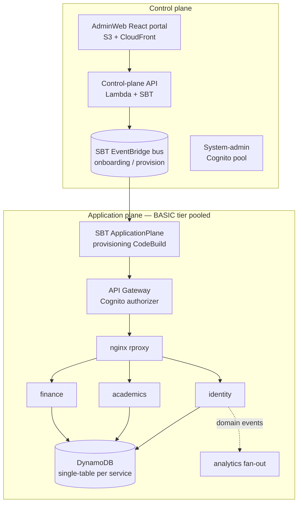

# EdForge

EdForge is a multi-tenant Education Management Information System (EMIS) for
K–12 schools: enrolment, attendance, academics, exams, results, finance, and
the regional/national reporting that ties a school back to its education data
standard. It is [Ed-Fi v6](https://www.ed-fi.org/)-aligned and built for
**archetypes** of school operations rather than a single country or product
tier — the first shipped archetype serves community and private schools in
Nepal. EdForge runs in a production pilot today, is developed and maintained by
a single engineer, and is **source-available** (Business Source License 1.1 —
see [Licensing](#licensing)). This repository is the backend: the AWS
infrastructure, the NestJS services, and the shared contract packages. The
runtime shape is documented in [ARCHITECTURE.md](ARCHITECTURE.md).

The notable thing about EdForge is less *what* it is than *how* it is built: a
one-person team ships a multi-service AWS SaaS by having coding agents execute
against **written specifications** under a set of machine-enforced invariants.
The [development workflow](#development-workflow) section describes that
concretely.

---

## Architecture at a glance

EdForge is a multi-tenant SaaS in a single AWS account, split into a **control
plane** (manages tenants) and an **application plane** (runs each tenant's
workload). The two communicate over Amazon EventBridge.



**Stack.** NestJS 10 services on Amazon ECS Fargate; Amazon DynamoDB
(single-table design, one table per service); Amazon Cognito for auth; API
Gateway + an nginx reverse proxy for request routing; EventBridge for domain
events; AWS CDK 2.195 with the [`@cdklabs/sbt-aws`](https://github.com/awslabs/sbt-aws)
SaaS Builder Toolkit (0.9.x) for the control plane. Five CDK stacks
(`shared-infra`, `controlplane`, `analytics`, `core-appplane`,
`tenant-template-basic`) deploy in dependency order.

**Services.** Three NestJS backends —
`identity` (tenant users, roles, schools, workspace/regional settings, ABAC),
`academics` (academic years, calendar, grade levels, courses, exams, results),
and `finance` (fee structures, invoices, payments, ledger) — plus `rproxy`, an
nginx container that routes tenant-API requests by URL prefix.

**Multi-tenancy.** The BASIC tier is **pooled**: all tenants share one ECS
cluster and shared DynamoDB tables (`edforge-identity-basic`, etc.). Isolation
is ABAC, not separate infrastructure:

- Every item's partition key is the **bare tenant UUID**. Each service's ECS
  task role is scoped with a DynamoDB `dynamodb:LeadingKeys` condition tied to
  a `tenant` principal tag, so a request can only read/write items in its own
  tenant's partition.
- Tenant context is resolved from the Cognito JWT — `custom:tenantId`,
  `custom:tenantTier`, `custom:userRole` claims, validated via JWKS in
  [`server/application/libs/auth/src/jwt.strategy.ts`](server/application/libs/auth/src/jwt.strategy.ts).
  A token-vending step then assumes the tenant-scoped role with those claims as
  session tags.
- GSI reads can't use `LeadingKeys` (indexes have their own keys), so
  index-query tenant filtering happens in application code — a documented,
  narrower isolation surface.

Dedicated-cluster / dedicated-pool isolation for `ADVANCED` and `PREMIUM` tiers
exists as CDK scaffolding but is **not deployed in V1** (labelled
`V1_DEFERRED`). See [ARCHITECTURE.md](ARCHITECTURE.md) for the full topology,
data model, and event envelope.

---

## Development workflow

EdForge is developed by coding agents working against written specifications,
held to invariants that are enforced automatically. A change moves like this:

1. **Spec.** Work is specified as prose before it is written — the `docs/`
   tree holds per-sprint plans (`docs/*/sprint-plan.md`) that name the endpoints,
   entities, tests, and acceptance checks for each slice. Agents implement
   against the spec, not an ad-hoc prompt.
2. **Conventions.** [AGENTS.md](AGENTS.md) is the canonical engineering-
   conventions document — the deploy ladder, the dependency pins that must not
   drift, the archetype rules, and a catalogue of edit traps discovered the
   hard way. It is shared by every agent that works the repo (Claude Code loads
   it via [CLAUDE.md](CLAUDE.md)).
3. **PR.** Every change branches from `main` (`sprint/<topic>` or
   `fix/<topic>`), is one concern, ships its tests in the same PR, uses
   conventional-commit titles, and is signed off under the Developer
   Certificate of Origin. See [CONTRIBUTING.md](CONTRIBUTING.md).
4. **CI gates.** Seven GitHub Actions workflows run on every push and PR to
   `main` and block merge:

   | Workflow | Enforces |
   |---|---|
   | `lint` | ESLint over `server` + `packages` (errors block; ~650 `any` / ~160 unused-var findings are a tracked ratchet of warnings, not breakers) |
   | `cdk-typecheck` | Type-checks the CDK app (`tsc -p tsconfig.cdk.json`), which `nest build` does not compile |
   | `archetype-invariants` | Fails any `country === 'NPL'`-style branch in service code — logic must branch on `archetype`, so the codebase scales to new archetypes without rewrites |
   | `secret-scan` | gitleaks over the diff — blocks credentials, JWTs, account IDs, prod tenant UUIDs |
   | `abac-conformance` | The RBAC/ABAC permission-matrix and guard test suite |
   | `authz-coverage` | Every route must appear in an authz baseline; a new unguarded route fails the build |
   | `deploy-evidence-hygiene` | Keeps raw deploy logs / ARNs / tenant data out of committed docs |

5. **Local pre-PR checks (advisory).** Two static checks run by hand, not yet
   wired into CI:
   - `npm run lint:routes` — the **route-drift linter**
     ([`scripts/check-route-drift.ts`](scripts/check-route-drift.ts)). A new API
     route must be registered in **three** places in lockstep: the NestJS
     controller, the hand-maintained API Gateway OpenAPI spec
     (`server/lib/tenant-api-prod.json`), and — for a new URL prefix — the
     nginx template. Miss the OpenAPI spec and the route returns `403 SigV4`;
     miss nginx and it returns `404`. The linter parses the controllers and
     diffs them against the spec so the drift is caught before deploy instead
     of in a live smoke test.
   - Spectral OpenAPI linting (`.spectral.yaml`), currently applied to the
     analytics sub-spec.

The point of the gates is that a solo maintainer cannot manually re-verify every
invariant on every agent-authored change — so the invariants that have caused
real incidents (unscoped routes, country-coupled logic, leaked identifiers,
uncompiled CDK) are machine-checked instead.

---

## Local setup

You need Node 18+, npm, and Docker. From the repo root:

```bash
npm ci                      # install all workspaces
npm run build:shared-types  # build the shared contract package first
npm run typecheck           # shared-types + services + CDK + client
npm run lint
npm test                    # jest unit suite (server/application)
```

To run the backend services locally against emulated AWS (LocalStack +
DynamoDB Local):

```bash
cd server
docker compose -f docker-compose.local.yml up -d
../scripts/local-setup.sh   # create tables and seed data
```

That brings up `identity` (:3010) and `academics` (:3011) with `SKIP_ABAC=true`.
`finance` and `rproxy` are not in the local compose file yet, so a full
end-to-end evaluation still requires deploying to an AWS account — the deploy
ladder is documented in [ARCHITECTURE.md](ARCHITECTURE.md#production-deployment).
A complete clone-and-run local loop is a roadmap item, not finished today.

---

## Testing and CI

- **Unit / component:** `npm test` (Jest, per-service under
  `server/application`). Run one suite with
  `cd server/application && npx jest <path>`.
- **ABAC conformance:** `npm run test:abac` — the permission-matrix, guard, and
  cross-tenant suites (also the `abac-conformance` CI gate).
- **Script tests:** `npm run test:scripts`.
- **Smoke tests** (against a deployed environment, not a gate):
  `npm run smoke:identity`, `npm run smoke:academics-sp1`.
- **CI:** the seven workflows in [`.github/workflows/`](.github/workflows/) run
  on every push and PR to `main`. `lint`, `cdk-typecheck`,
  `archetype-invariants`, `secret-scan`, `abac-conformance`, `authz-coverage`,
  and `deploy-evidence-hygiene` block merge; see the workflow table above.

---

## Project status

Honest state of the codebase:

- **Production pilot.** Live with a pilot school on the Nepal community/private-
  school archetype. Single maintainer.
- **`BASIC` tier only.** `ADVANCED` / `PREMIUM` scaffolding exists but is
  dormant (`V1_DEFERRED`) — dormant, not dead; don't delete it as cleanup.
- **One archetype shipped** (`PABSON`) with a `GENERIC` fallback. Other
  archetype enum values (`CBSE_IN`, `NAIS_US`, `GEMS_UAE`) are type-only
  reservations, not runtime-valid.
- **Single AWS region per environment.** The data model is multi-region-ready;
  the deployment is not.
- **The tenant-facing web frontend is a separate repository** (a
  module-federation host with per-domain MFEs) and is not public yet. This repo
  serves its APIs.
- **In progress:** completing the local-dev loop, and the V1 platform-hardening
  plan under [`docs/platform-hardening/`](docs/platform-hardening/sprint-plan.md).

---

## Licensing

EdForge is licensed under the **Business Source License 1.1** — see
[LICENSE](LICENSE). In plain terms: you may read the source, run it for your own
organization (including a for-profit school), modify it, and redistribute it
under the same license; you may **not** offer it as a hosted or managed service
to third parties without a commercial license. On the Change Date (June 1,
2030) the license converts to Apache License 2.0.

EdForge builds on the [AWS SaaS Builder Toolkit](https://github.com/awslabs/sbt-aws)
and the [`aws-samples/saas-reference-architecture-ecs`](https://github.com/aws-samples/saas-reference-architecture-ecs)
reference architecture (Apache-2.0); its data model aligns to the
[Ed-Fi Data Standard v6](https://www.ed-fi.org/). See [NOTICE](NOTICE) for
upstream attribution and [THIRD_PARTY_LICENSES.md](THIRD_PARTY_LICENSES.md) for
the full dependency enumeration.

---

## Documentation

| When you want… | Read |
|---|---|
| Runtime architecture, stacks, data model, event flow | [ARCHITECTURE.md](ARCHITECTURE.md) |
| Engineering conventions, deploy ladder, edit traps | [AGENTS.md](AGENTS.md) |
| Contribution workflow + DCO sign-off | [CONTRIBUTING.md](CONTRIBUTING.md) |
| Responsible disclosure | [SECURITY.md](SECURITY.md) |
| Licensing + attribution | [LICENSE](LICENSE), [NOTICE](NOTICE) |
