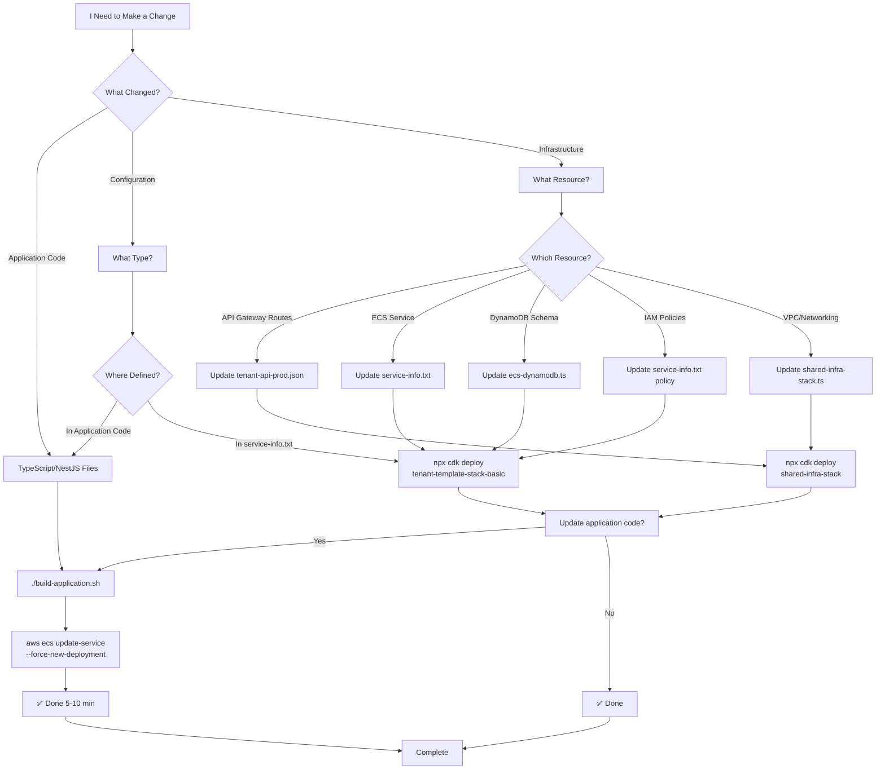

# AWS CLI Operations Guide for EdForge

> **Purpose**: Practical AWS CLI workflows for daily development operations — application code deployments, CDK infrastructure changes, and troubleshooting.

**Last Updated**: February 21, 2026

---

## Table of Contents

1. [Quick Reference](#quick-reference)
2. [EdForge Architecture Overview](#edforge-architecture-overview)
3. [CDK Prerequisites](#cdk-prerequisites)
4. [Daily Development Workflows](#daily-development-workflows)
5. [Clean Fresh Deployment](#clean-fresh-deployment)
6. [Service Management](#service-management)
7. [Debugging and Troubleshooting](#debugging-and-troubleshooting)
8. [Infrastructure Updates](#infrastructure-updates)
9. [Best Practices](#best-practices)

---

## Quick Reference

### When to Use What

| Task | Tool | Time | Command |
|------|------|------|---------|
| **Clean fresh deployment** | **Script** | **15-20 min** | **`./fresh-deploy.sh`** |
| Update application code | AWS CLI | 5-10 min | `aws ecs update-service --force-new-deployment` |
| Scale service up/down | AWS CLI | 2 min | `aws ecs update-service --desired-count N` |
| View service logs | AWS CLI | Instant | `aws logs tail /ecs/{service} --follow` |
| Add new API route | CDK | 10-15 min | `CDK_NAG_ENABLED=false npx cdk deploy shared-infra-stack` |
| Add new service | CDK | 15-20 min | `CDK_NAG_ENABLED=false npx cdk deploy tenant-template-stack-basic` |
| Change IAM/ABAC policies | CDK | 10-15 min | `CDK_NAG_ENABLED=false npx cdk deploy tenant-template-stack-basic` |
| Change DynamoDB schema | CDK | 10-15 min | `CDK_NAG_ENABLED=false npx cdk deploy tenant-template-stack-basic` |
| Rollback deployment | AWS CLI | 5 min | `aws ecs update-service --task-definition {old}` |
| Check service health | AWS CLI | Instant | `aws ecs describe-services` |

### Environment Setup

```bash
# Set AWS profile and region for all commands
# IMPORTANT: Use the correct profile for your environment
export AWS_PROFILE=uat
export AWS_REGION=us-east-2

# Commonly used variables
export CLUSTER_NAME=prod-basic
export ACCOUNT_ID=$(aws sts get-caller-identity --query Account --output text)

# Verify credentials work
aws sts get-caller-identity
```

### Common Clusters and Services

```bash
# Clusters
prod-basic                    # Basic tier (shared)
prod-advanced-{accountId}     # Advanced tier (shared)
prod-{tenantId}              # Premium tier (dedicated per tenant)

# Services (Basic Tier)
identitybasic                 # Identity/auth service
academicsbasic               # Academics service
financebasic                 # Finance service (fees, invoices, payments, gateways)
rproxybasic                  # Reverse proxy

# Services (Premium Tier - example)
identitypremium-tenant123
academicspremium-tenant123
financepremium-tenant123
rproxypremium-tenant123
```

---

## EdForge Architecture Overview

### CDK Stack Hierarchy

EdForge uses AWS CDK with four CloudFormation stacks deployed in order:

```
shared-infra-stack                  # VPC, ALB, API Gateway, tenant mapping table
  └── controlplane-stack            # Cognito, SBT Event Bus, Control Plane API
        └── tenant-template-stack-basic    # ECS cluster, services, DynamoDB tables, IAM roles
        └── tenant-template-stack-advanced # (same, for advanced tier)
```

**What lives in each stack:**

| Stack | Contains | When to Deploy |
|-------|----------|----------------|
| `shared-infra-stack` | VPC, ALB, API Gateway, route definitions | Adding/changing API routes |
| `controlplane-stack` | Cognito User Pool, Event Bus, Control Plane API | Changing auth config |
| `tenant-template-stack-basic` | ECS cluster + services, DynamoDB tables, IAM task roles, ABAC roles | Adding services, changing IAM/ABAC policies, DynamoDB schema |

### How Code Gets to Production

There are **two independent paths** to production. Most changes require both:

```
APPLICATION CODE (TypeScript in server/application/)
  1. Build Docker images    → scripts/build-application.sh
  2. Push to ECR            → (included in build script)
  3. Force ECS redeploy     → aws ecs update-service --force-new-deployment

INFRASTRUCTURE (CDK in server/lib/)
  1. CDK synth + deploy     → npx cdk deploy {stack-name}
  2. CloudFormation updates  → (automatic — updates IAM roles, DynamoDB, task definitions)
```

**If your change touches both** (e.g., new DynamoDB action + code that uses it), you must:
1. CDK deploy **first** (so IAM policy is updated)
2. Build + push Docker images **second** (so new code runs with new permissions)
3. Force ECS redeploy **last** (so running tasks pick up both changes)

### IAM: Two Types of Policies

EdForge uses a dual-role IAM pattern for tenant isolation:

```
ECS Task Role (identity-ecsTaskRole / academics-ecsTaskRole / finance-ecsTaskRole)
  ├── Direct permissions: GetItem, PutItem, UpdateItem, Query (for pre-auth bootstrap)
  ├── Defined in: server/lib/tenant-template/tenant-template-stack.ts
  └── Can assume → ABAC Role (via STS AssumeRole + TagSession)

ABAC Role (identity-ABACRole / academics-ABACRole / finance-ABACRole)
  ├── Tenant-scoped permissions via LeadingKeys condition
  ├── Defined in: server/lib/tenant-template/ecs-dynamodb.ts (policyDocument)
  └── Used by: TokenVendingMachine at runtime for all tenant-scoped DynamoDB operations
```

**When changing DynamoDB permissions** (e.g., adding `BatchGetItem`), you edit `ecs-dynamodb.ts`, NOT `service-info.txt`. The `service-info.txt` policies are for the task role's additional permissions (e.g., S3 access, SES, EventBridge).

---

## CDK Prerequisites

### Required: `.env` File

CDK reads environment variables from `server/.env` via `dotenv/config`. This file must exist before running any `cdk` command.

```bash
# First-time setup: copy the example and edit
cp /Users/shoaibrain/edforge/server/.env.example /Users/shoaibrain/edforge/server/.env
```

**Required variables in `.env`:**

```bash
# Required — CDK will throw if missing
CDK_PARAM_SYSTEM_ADMIN_EMAIL=admin@example.com
CDK_PARAM_TIER=basic
CDK_PARAM_COMMIT_ID=311d5fa          # Any git short hash

# Defaults (usually fine as-is)
CDK_PARAM_TENANT_ID=basic
CDK_PARAM_TENANT_NAME=basic
CDK_PARAM_STAGE=prod
CDK_PARAM_USE_FEDERATION=true
CDK_PARAM_USE_EC2_BASIC=false
CDK_PARAM_USE_RPROXY=true
CDK_ADV_CLUSTER=INACTIVE

# CDK Nag — security linter (blocks deploy if errors found)
CDK_NAG_ENABLED=true
```

### CDK Nag: Must Disable for Deployments

CDK Nag is a security linter enabled in `.env` (`CDK_NAG_ENABLED=true`). It reports pre-existing warnings (managed policies, wildcard resources, plaintext env vars) that **block the deploy**.

**To deploy, always prefix CDK commands with `CDK_NAG_ENABLED=false`:**

```bash
# This FAILS (CDK Nag blocks it):
AWS_PROFILE=uat npx cdk deploy tenant-template-stack-basic --require-approval=never

# This WORKS (CDK_NAG_ENABLED=false overrides the .env value):
CDK_NAG_ENABLED=false AWS_PROFILE=uat npx cdk deploy tenant-template-stack-basic --require-approval=never
```

The `CDK_NAG_ENABLED=false` prefix overrides the `.env` value for that single command only. Your `.env` stays unchanged.

### CDK Node Dependencies

CDK dependencies live in `server/node_modules/`. If missing:

```bash
cd /Users/shoaibrain/edforge/server
npm install
```

---

## Daily Development Workflows

### Scenario 1: Update Application Code (Most Common)

**Use Case**: You changed TypeScript code in Identity, Academics, or Finance service

**Time**: 5-10 minutes

**Steps**:

```bash
# Step 1: Navigate to scripts directory
cd /Users/shoaibrain/edforge/scripts

# Step 2: Build and push new Docker images
AWS_PROFILE=uat ./build-application.sh

# What this does:
# - Builds shared-types package
# - Builds Docker images for identity, academics, finance, rproxy
# - Pushes images to ECR with 'latest' tag

# Step 3: Force ECS to deploy new images (only the services you changed)
AWS_PROFILE=uat aws ecs update-service \
  --cluster prod-basic \
  --service academicsbasic \
  --force-new-deployment \
  --region $AWS_REGION

# Step 4: Monitor deployment progress
AWS_PROFILE=uat aws ecs describe-services \
  --cluster prod-basic \
  --services academicsbasic \
  --region $AWS_REGION \
  --query 'services[*].{name:serviceName,status:status,running:runningCount,desired:desiredCount,deployments:deployments[*].{status:status,desired:desiredCount,running:runningCount}}'

# Step 5: Watch logs for new tasks
AWS_PROFILE=uat aws logs tail /ecs/academicsbasic --follow --region $AWS_REGION
```

**What Happens**:
- New Docker images are pulled from ECR
- New tasks are created with updated code
- Old tasks are drained gracefully (zero downtime)
- **NO CDK deployment required**
- **NO infrastructure changes**

**Troubleshooting**:
- If deployment stuck: Check service events (see [Debugging](#debugging-and-troubleshooting))
- If tasks crash: Check CloudWatch logs
- If image pull fails: Verify ECR repository exists

---

### Scenario 2: Add New API Route

**Use Case**: Add `/teachers` endpoint to Academics service

**Time**: 10-15 minutes

**Steps**:

```bash
# Step 1: Update OpenAPI specification
vim /Users/shoaibrain/edforge/server/lib/tenant-api-prod.json

# Add new route definition (example):
{
  "paths": {
    "/teachers": {
      "get": {
        "parameters": [{
          "name": "tenantPath",
          "in": "header",
          "required": true,
          "type": "string"
        }],
        "responses": {},
        "security": [{
          "sharedApigatewayTenantApiAuthorizer": []
        }],
        "x-amazon-apigateway-integration": {
          "type": "http_proxy",
          "connectionId": "{{connection_id}}",
          "httpMethod": "ANY",
          "uri": "{{integration_uri}}/teachers",
          "requestParameters": {
            "integration.request.header.tenantPath": "context.authorizer.tenantPath"
          },
          "connectionType": "VPC_LINK",
          "passthroughBehavior": "when_no_match"
        }
      }
    }
  }
}

# Step 2: Deploy SharedInfraStack (updates API Gateway)
cd /Users/shoaibrain/edforge/server
CDK_NAG_ENABLED=false npx cdk deploy shared-infra-stack --require-approval=never

# Step 3: Implement controller in academics service
vim /Users/shoaibrain/edforge/server/application/microservices/academics/src/teachers/teachers.controller.ts

# Example implementation:
@Controller('teachers')
export class TeachersController {
  @Get()
  async findAll(@Request() req) {
    const tenantId = req.user.tenantId;
    return await this.teachersService.findAll(tenantId);
  }
}

# Step 4: Update NGINX proxy configuration (if needed)
vim /Users/shoaibrain/edforge/server/application/reverseproxy/nginx.template

# Add route:
location /teachers {
    proxy_pass http://academics-api.${NAMESPACE}.sc:3010;
    proxy_http_version 1.1;
    proxy_set_header Host $host;
}

# Step 5: Build and deploy application code
cd /Users/shoaibrain/edforge/scripts
./build-application.sh

aws ecs update-service \
  --cluster prod-basic \
  --service academicsbasic \
  --force-new-deployment \
  --region $AWS_REGION

aws ecs update-service \
  --cluster prod-basic \
  --service rproxybasic \
  --force-new-deployment \
  --region $AWS_REGION

# Step 6: Test new endpoint
API_URL=$(aws cloudformation describe-stacks \
  --stack-name shared-infra-stack \
  --query "Stacks[0].Outputs[?OutputKey=='ApiGatewayUrl'].OutputValue" \
  --output text)

curl -X GET "$API_URL/teachers" \
  -H "Authorization: Bearer {JWT_TOKEN}" \
  -H "x-api-key: {API_KEY}"
```

**Why Both Steps Are Needed**:
- API Gateway needs to know about the new route (infrastructure)
- Application code needs to implement the endpoint logic (application)

---

### Scenario 3: Change Environment Variable (Application-Level)

**Use Case**: Update a hardcoded URL or configuration in application code

**Time**: 5-10 minutes

**If Variable is Hardcoded in Application**:

```bash
# Step 1: Update the variable in your TypeScript code
vim /Users/shoaibrain/edforge/server/application/microservices/academics/src/config/config.ts

# Change:
export const config = {
  identityServiceUrl: 'http://identity-api.basic.sc:3010',  // Old
  tenantServiceUrl: 'http://tenant-api.basic.sc:3010'       // Old
}

# To:
export const config = {
  identityServiceUrl: process.env.IDENTITY_SERVICE_URL,
  tenantServiceUrl: process.env.TENANT_SERVICE_URL
}

# Step 2: Build and deploy
cd /Users/shoaibrain/edforge/scripts
./build-application.sh

aws ecs update-service \
  --cluster prod-basic \
  --service academicsbasic \
  --force-new-deployment \
  --region $AWS_REGION
```

**If Variable is in service-info.txt**:

```bash
# Step 1: Update service-info.txt
vim /Users/shoaibrain/edforge/server/service-info.txt

# Change environment section:
"environment": {
  "TABLE_NAME": "edforge-academics-<TIER>",
  "NEW_VARIABLE": "new-value"  # Add this
}

# Step 2: Deploy TenantTemplateStack (updates task definition)
cd /Users/shoaibrain/edforge/server
CDK_NAG_ENABLED=false npx cdk deploy tenant-template-stack-basic --require-approval=never

# Note: CDK required because environment variables in task definition are infrastructure
```

**Decision Guide**:
- **Hardcoded in app** → Application update (no CDK)
- **In service-info.txt** → Infrastructure update (CDK required)

---

### Scenario 4: Fix a Bug and Deploy Quickly

**Use Case**: Critical production bug, need fast deployment

**Time**: 5 minutes

**Steps**:

```bash
# Step 1: Fix the bug in your code
vim /Users/shoaibrain/edforge/server/application/microservices/academics/src/students/students.service.ts

# Step 2: Build ONLY the affected service (faster)
cd /Users/shoaibrain/edforge/server/application

# Login to ECR
aws ecr get-login-password --region $AWS_REGION | \
  docker login --username AWS --password-stdin \
  ${ACCOUNT_ID}.dkr.ecr.${AWS_REGION}.amazonaws.com

# Build only academics (from monorepo root)
cd /Users/shoaibrain/edforge
docker build -t ${ACCOUNT_ID}.dkr.ecr.${AWS_REGION}.amazonaws.com/academics:latest \
  -f server/application/Dockerfile.academics .

# Push
docker push ${ACCOUNT_ID}.dkr.ecr.${AWS_REGION}.amazonaws.com/academics:latest

# Step 3: Force immediate deployment
aws ecs update-service \
  --cluster prod-basic \
  --service academicsbasic \
  --force-new-deployment \
  --region $AWS_REGION

# Step 4: Monitor deployment
aws ecs describe-services \
  --cluster prod-basic \
  --services academicsbasic \
  --region $AWS_REGION \
  --query 'services[0].deployments[*].{status:status,desired:desiredCount,running:runningCount,createdAt:createdAt}'

# Step 5: Watch for errors in real-time
aws logs tail /ecs/academicsbasic --follow --since 5m
```

**Pro Tip**: For even faster deployment, increase `maximumPercent` to 200 and `minimumHealthyPercent` to 0 in service-info.txt (for dev only!).

---

### Scenario 5: Test Changes Locally Before Deployment

**Use Case**: Want to verify changes work before pushing to AWS

**Steps**:

```bash
# Step 1: Build Docker image locally
cd /Users/shoaibrain/edforge
docker build -t academics-local:latest \
  -f server/application/Dockerfile.academics .

# Step 2: Run container locally
docker run -p 3010:3010 \
  -e TABLE_NAME=edforge-academics-basic \
  -e AWS_REGION=$AWS_REGION \
  -e PORT=3010 \
  -e AWS_ACCESS_KEY_ID=${AWS_ACCESS_KEY_ID} \
  -e AWS_SECRET_ACCESS_KEY=${AWS_SECRET_ACCESS_KEY} \
  -e AWS_SESSION_TOKEN=${AWS_SESSION_TOKEN} \
  academics-local:latest

# Step 3: Test locally
curl http://localhost:3010/health

curl -X POST http://localhost:3010/students \
  -H "Content-Type: application/json" \
  -d '{"firstName":"John","lastName":"Doe","grade":"10"}'

# Step 4: If tests pass, deploy to AWS
# (Use normal deployment workflow)
```

---

### Scenario 6: Deploy Finance Service (First-Time)

**Use Case**: Finance service is new and needs initial infrastructure + application deployment

**Time**: 15-20 minutes

**What Gets Created**:
- ECR repository `finance` (auto-created by build script if missing)
- ECS Task Definition (`finance-container`, 256 CPU / 512 MB, port 3010)
- ECS Fargate Service (`financebasic`, desired=1)
- DynamoDB Table (`edforge-finance-basic`, PK=tenantId, SK=entityKey, PAY_PER_REQUEST)
- IAM Task Role + ABAC Role (tenant-scoped DynamoDB + EventBridge + STS)
- Service Connect DNS: `finance-api.{namespace}.sc:3010`
- ALB Target Group + Listener Rule (`tenantPath=basic` + `/finance*`)
- CloudWatch Log Group: `/ecs/financebasic`

**Steps**:

```bash
# Step 1: Deploy API Gateway routes (adds /finance/* paths)
cd /Users/shoaibrain/edforge/server
CDK_NAG_ENABLED=false AWS_PROFILE=uat npx cdk deploy shared-infra-stack --require-approval=never

# Step 2: Deploy tenant infrastructure (creates ECS service, DynamoDB table, IAM roles)
CDK_NAG_ENABLED=false AWS_PROFILE=uat npx cdk deploy tenant-template-stack-basic --require-approval=never

# Step 3: Build and push ALL Docker images (now includes finance)
cd /Users/shoaibrain/edforge/scripts
AWS_PROFILE=uat ./build-application.sh

# Step 4: Force ECS redeploy for finance + rproxy (NGINX has finance routing)
AWS_PROFILE=uat aws ecs update-service \
  --cluster prod-basic \
  --service financebasic \
  --force-new-deployment \
  --region $AWS_REGION

AWS_PROFILE=uat aws ecs update-service \
  --cluster prod-basic \
  --service rproxybasic \
  --force-new-deployment \
  --region $AWS_REGION

# Step 5: Monitor finance service startup
AWS_PROFILE=uat aws logs tail /ecs/financebasic --follow --region $AWS_REGION

# Expected log output:
# Finance Service running on port 3010
# DynamoDB Table: edforge-finance-basic
# Identity Service: http://identity-api.basic.sc:3010
# Health endpoints: /health, /health/ready, /health/live

# Step 6: Test health endpoint
API_URL=$(aws cloudformation describe-stacks \
  --stack-name shared-infra-stack \
  --query "Stacks[0].Outputs[?OutputKey=='ApiGatewayUrl'].OutputValue" \
  --output text)

curl -X GET "$API_URL/finance/schools/{schoolId}/fee-structures" \
  -H "Authorization: Bearer {JWT_TOKEN}" \
  -H "x-api-key: {API_KEY}"
```

**External Dependencies**:
- Finance service makes outbound HTTPS calls to payment gateway sandbox URLs:
  - eSewa: `rc-epay.esewa.com.np` (test) / `epay.esewa.com.np` (prod)
  - Khalti: `dev.khalti.com` (test) / `khalti.com` (prod)
- ECS security group has `allowAllOutbound: true` so no SG changes needed
- Gateway credentials are stored in DynamoDB (admin configures via `/finance/schools/{id}/payment-gateways/{gateway}`)

**Troubleshooting**:
- If finance service can't reach identity service: Verify Service Connect DNS (`identity-api.{namespace}.sc:3010`) is resolving
- If DynamoDB errors: Verify `edforge-finance-basic` table was created by CDK
- If payment gateway calls fail: Check outbound connectivity and gateway credentials in DynamoDB

---

## Clean Fresh Deployment

> **Purpose**: Complete redeployment of all services with fresh Docker images and ECS tasks, without destroying infrastructure (VPC, DynamoDB tables, etc.)

**When to Use**:
- After major code changes across multiple services
- When you want to ensure all services are running latest code
- After fixing critical bugs that require full restart
- Before important demos or testing

**Time**: 15-20 minutes

**What Gets Updated**:
- ✅ All Docker images (rebuilt and pushed)
- ✅ All ECS services (force new deployment)
- ✅ All running tasks (replaced with fresh instances)
- ❌ Infrastructure remains intact (VPC, DynamoDB, IAM roles, etc.)

---

### Step-by-Step: Complete Fresh Deployment

#### Step 1: Environment Setup

```bash
# Set AWS profile and region
# IMPORTANT: Use the correct profile for your environment
export AWS_PROFILE=uat
export AWS_REGION=us-east-2

# Set cluster and account variables
export CLUSTER_NAME=prod-basic
export ACCOUNT_ID=$(aws sts get-caller-identity --query Account --output text)

# Verify AWS credentials
aws sts get-caller-identity
```

#### Step 2: Pre-Deployment Health Check

```bash
# Check current service status
aws ecs describe-services \
  --cluster $CLUSTER_NAME \
  --services identitybasic academicsbasic financebasic rproxybasic \
  --region $AWS_REGION \
  --query 'services[*].{name:serviceName,status:status,running:runningCount,desired:desiredCount}' \
  --output table

# Verify ECR repositories exist
aws ecr describe-repositories \
  --repository-names identity academics finance rproxy \
  --region $AWS_REGION \
  --query 'repositories[*].repositoryName' \
  --output table
```

#### Step 3: Build and Push Fresh Docker Images

```bash
# Navigate to scripts directory
cd /Users/shoaibrain/edforge/scripts

# Build all services (shared-types, identity, academics, finance, rproxy)
# This rebuilds Docker images from scratch and pushes to ECR
./build-application.sh

# Verify images were pushed (check timestamps)
aws ecr describe-images \
  --repository-name identity \
  --region $AWS_REGION \
  --query 'sort_by(imageDetails,& imagePushedAt)[-1].{pushed:imagePushedAt,tags:imageTags}' \
  --output table

aws ecr describe-images \
  --repository-name academics \
  --region $AWS_REGION \
  --query 'sort_by(imageDetails,& imagePushedAt)[-1].{pushed:imagePushedAt,tags:imageTags}' \
  --output table

aws ecr describe-images \
  --repository-name rproxy \
  --region $AWS_REGION \
  --query 'sort_by(imageDetails,& imagePushedAt)[-1].{pushed:imagePushedAt,tags:imageTags}' \
  --output table
```

#### Step 4: Force Fresh Deployment of All Services

```bash
# Deploy Identity service
echo "Deploying Identity service..."
aws ecs update-service \
  --cluster $CLUSTER_NAME \
  --service identitybasic \
  --force-new-deployment \
  --region $AWS_REGION

# Deploy Academics service
echo "Deploying Academics service..."
aws ecs update-service \
  --cluster $CLUSTER_NAME \
  --service academicsbasic \
  --force-new-deployment \
  --region $AWS_REGION

# Deploy Reverse Proxy service
echo "Deploying Reverse Proxy service..."
aws ecs update-service \
  --cluster $CLUSTER_NAME \
  --service rproxybasic \
  --force-new-deployment \
  --region $AWS_REGION
```

#### Step 5: Monitor Deployment Progress

```bash
# Watch deployment status (run in separate terminal or background)
watch -n 5 "aws ecs describe-services \
  --cluster $CLUSTER_NAME \
  --services identitybasic academicsbasic financebasic rproxybasic \
  --region $AWS_REGION \
  --query 'services[*].{name:serviceName,status:status,running:runningCount,desired:desiredCount,pending:pendingCount,deployments:deployments[*].{status:status,desired:desiredCount,running:runningCount}}' \
  --output table"

# Or check once (wait 30 seconds between checks)
echo "Waiting for deployments to stabilize..."
sleep 30

aws ecs describe-services \
  --cluster $CLUSTER_NAME \
  --services identitybasic academicsbasic financebasic rproxybasic \
  --region $AWS_REGION \
  --query 'services[*].{name:serviceName,status:status,running:runningCount,desired:desiredCount,pending:pendingCount,deployments:deployments[*].{status:status,desired:desiredCount,running:runningCount}}' \
  --output table
```

#### Step 6: Verify All Services Are Running

```bash
# Check service health (should show all services as ACTIVE)
aws ecs describe-services \
  --cluster $CLUSTER_NAME \
  --services identitybasic academicsbasic financebasic rproxybasic \
  --region $AWS_REGION \
  --query 'services[*].{name:serviceName,status:status,running:runningCount,desired:desiredCount,events:events[0].message}' \
  --output table

# Verify all tasks are running
aws ecs list-tasks \
  --cluster $CLUSTER_NAME \
  --service-name identitybasic \
  --desired-status RUNNING \
  --region $AWS_REGION \
  --query 'taskArns[]' \
  --output text | wc -l

aws ecs list-tasks \
  --cluster $CLUSTER_NAME \
  --service-name academicsbasic \
  --desired-status RUNNING \
  --region $AWS_REGION \
  --query 'taskArns[]' \
  --output text | wc -l

aws ecs list-tasks \
  --cluster $CLUSTER_NAME \
  --service-name rproxybasic \
  --desired-status RUNNING \
  --region $AWS_REGION \
  --query 'taskArns[]' \
  --output text | wc -l
```

#### Step 7: Check Application Logs

```bash
# Tail Identity service logs (check for startup errors)
echo "Checking Identity service logs..."
aws logs tail /ecs/identitybasic \
  --since 5m \
  --region $AWS_REGION | tail -20

# Tail Academics service logs
echo "Checking Academics service logs..."
aws logs tail /ecs/academicsbasic \
  --since 5m \
  --region $AWS_REGION | tail -20

# Tail Finance service logs
echo "Checking Finance service logs..."
aws logs tail /ecs/financebasic \
  --since 5m \
  --region $AWS_REGION | tail -20

# Tail Reverse Proxy logs
echo "Checking Reverse Proxy logs..."
aws logs tail /ecs/rproxybasic \
  --since 5m \
  --region $AWS_REGION | tail -20
```

#### Step 8: Verify Application Endpoints

```bash
# Get API Gateway URL
API_URL=$(aws cloudformation describe-stacks \
  --stack-name shared-infra-stack \
  --query "Stacks[0].Outputs[?OutputKey=='ApiGatewayUrl'].OutputValue" \
  --output text \
  --region $AWS_REGION)

echo "API Gateway URL: $API_URL"

# Test health endpoints (if you have API key and token)
# curl -X GET "$API_URL/health" \
#   -H "x-api-key: {YOUR_API_KEY}"

# Or test service discovery endpoints directly (from within VPC)
# curl http://identity-api.basic.sc:3010/health
# curl http://academics-api.basic.sc:3010/health
```

---

### Automated Script: One-Command Deployment

For the easiest deployment experience, use the provided script:

```bash
# Run the automated fresh deployment script
cd /Users/shoaibrain/edforge/scripts
./fresh-deploy.sh
```

**What the script does**:
- ✅ Verifies AWS credentials and ECR repositories
- ✅ Builds and pushes all Docker images
- ✅ Deploys all services (identity, academics, finance, rproxy)
- ✅ Monitors deployment progress
- ✅ Verifies final status and shows recent logs

### One-Liner: Quick Fresh Deployment (Manual)

For rapid redeployment when you're confident everything is set up:

```bash
cd /Users/shoaibrain/edforge/scripts && \
./build-application.sh && \
aws ecs update-service --cluster prod-basic --service identitybasic --force-new-deployment --region $AWS_REGION && \
aws ecs update-service --cluster prod-basic --service academicsbasic --force-new-deployment --region $AWS_REGION && \
aws ecs update-service --cluster prod-basic --service rproxybasic --force-new-deployment --region $AWS_REGION && \
echo "Deployment initiated. Monitor with: aws ecs describe-services --cluster prod-basic --services identitybasic academicsbasic financebasic rproxybasic --region $AWS_REGION"
```

---

### Troubleshooting Fresh Deployment

#### If Services Don't Start

```bash
# Check service events for errors
aws ecs describe-services \
  --cluster $CLUSTER_NAME \
  --services identitybasic \
  --region $AWS_REGION \
  --query 'services[0].events[0:10]' \
  --output table

# Check task failures
aws ecs list-tasks \
  --cluster $CLUSTER_NAME \
  --service-name identitybasic \
  --desired-status STOPPED \
  --region $AWS_REGION \
  --query 'taskArns[0]' \
  --output text | xargs -I {} \
  aws ecs describe-tasks \
    --cluster $CLUSTER_NAME \
    --tasks {} \
    --region $AWS_REGION \
    --query 'tasks[0].{status:lastStatus,stoppedReason:stoppedReason,containers:containers[*].{name:name,exitCode:exitCode,reason:reason}}'
```

#### If Deployment Stuck

```bash
# Check if old tasks are still draining
aws ecs describe-services \
  --cluster $CLUSTER_NAME \
  --services identitybasic \
  --region $AWS_REGION \
  --query 'services[0].deployments[*].{status:status,desired:desiredCount,running:runningCount,createdAt:createdAt}'

# If stuck, manually stop old tasks (use with caution)
# Get old task ARNs
OLD_TASKS=$(aws ecs list-tasks \
  --cluster $CLUSTER_NAME \
  --service-name identitybasic \
  --desired-status RUNNING \
  --region $AWS_REGION \
  --query 'taskArns[]' \
  --output text)

# Stop old tasks (ECS will start new ones)
for TASK in $OLD_TASKS; do
  aws ecs stop-task \
    --cluster $CLUSTER_NAME \
    --task $TASK \
    --reason "Force refresh deployment" \
    --region $AWS_REGION
done
```

#### If Images Not Found

```bash
# Verify ECR login
aws ecr get-login-password --region $AWS_REGION | \
  docker login --username AWS --password-stdin \
  ${ACCOUNT_ID}.dkr.ecr.${AWS_REGION}.amazonaws.com

# Rebuild and push specific service
cd /Users/shoaibrain/edforge
docker build -t ${ACCOUNT_ID}.dkr.ecr.${AWS_REGION}.amazonaws.com/identity:latest \
  -f server/application/Dockerfile.identity .
docker push ${ACCOUNT_ID}.dkr.ecr.${AWS_REGION}.amazonaws.com/identity:latest
```

---

### What's NOT Affected (Infrastructure Preserved)

✅ **These remain unchanged**:
- VPC and networking configuration
- DynamoDB tables and data
- IAM roles and policies
- API Gateway configuration
- CloudWatch log groups
- ECR repositories
- CloudFormation stacks

❌ **These get refreshed**:
- Docker container images
- ECS task definitions (if CDK deployed)
- Running ECS tasks
- Application code in containers

---

### Advanced: Selective Service Deployment

If you only want to refresh specific services:

```bash
# Refresh only Identity service
cd /Users/shoaibrain/edforge/scripts && \
docker build -t ${ACCOUNT_ID}.dkr.ecr.${AWS_REGION}.amazonaws.com/identity:latest \
  -f ../server/application/Dockerfile.identity ../ && \
docker push ${ACCOUNT_ID}.dkr.ecr.${AWS_REGION}.amazonaws.com/identity:latest && \
aws ecs update-service \
  --cluster prod-basic \
  --service identitybasic \
  --force-new-deployment \
  --region $AWS_REGION
```

---

## Service Management

### List All Services

```bash
# List services in a cluster
aws ecs list-services \
  --cluster prod-basic \
  --region $AWS_REGION

# List with more details
aws ecs list-services \
  --cluster prod-basic \
  --region $AWS_REGION \
  --output table
```

### Describe Service

```bash
# Get detailed service information
aws ecs describe-services \
  --cluster prod-basic \
  --services identitybasic \
  --region $AWS_REGION

# Formatted output (most useful info)
aws ecs describe-services \
  --cluster prod-basic \
  --services identitybasic \
  --region $AWS_REGION \
  --query 'services[0].{name:serviceName,status:status,running:runningCount,desired:desiredCount,pendingCount:pendingCount,taskDefinition:taskDefinition,events:events[0:3]}'

# Check recent events (for debugging)
aws ecs describe-services \
  --cluster prod-basic \
  --services identitybasic \
  --region $AWS_REGION \
  --query 'services[0].events[0:10]' \
  --output table
```

### Scale Service

```bash
# Scale up to 3 tasks
aws ecs update-service \
  --cluster prod-basic \
  --service academicsbasic \
  --desired-count 3 \
  --region $AWS_REGION

# Scale down to 1 task
aws ecs update-service \
  --cluster prod-basic \
  --service academicsbasic \
  --desired-count 1 \
  --region $AWS_REGION

# Verify scaling
aws ecs describe-services \
  --cluster prod-basic \
  --services academicsbasic \
  --region $AWS_REGION \
  --query 'services[0].{desired:desiredCount,running:runningCount,pending:pendingCount}'
```

### Stop All Tasks (Force Restart)

```bash
# List running tasks
TASKS=$(aws ecs list-tasks \
  --cluster prod-basic \
  --service-name identitybasic \
  --region $AWS_REGION \
  --query 'taskArns[]' \
  --output text)

# Stop each task (ECS will automatically start new ones)
for TASK in $TASKS; do
  aws ecs stop-task \
    --cluster prod-basic \
    --task $TASK \
    --reason "Manual restart" \
    --region $AWS_REGION
done

# Wait for new tasks to start
sleep 30

# Verify new tasks are running
aws ecs list-tasks \
  --cluster prod-basic \
  --service-name identitybasic \
  --region $AWS_REGION \
  --query 'taskArns[]'
```

### Update Service Configuration

```bash
# Update task definition (use specific revision)
aws ecs update-service \
  --cluster prod-basic \
  --service identitybasic \
  --task-definition identity:10 \
  --region $AWS_REGION

# Update deployment configuration
aws ecs update-service \
  --cluster prod-basic \
  --service identitybasic \
  --deployment-configuration "maximumPercent=200,minimumHealthyPercent=100" \
  --region $AWS_REGION

# Enable circuit breaker (prevents bad deployments)
aws ecs update-service \
  --cluster prod-basic \
  --service identitybasic \
  --deployment-configuration "deploymentCircuitBreaker={enable=true,rollback=true}" \
  --region $AWS_REGION
```

---

## Debugging and Troubleshooting

### View Service Logs

```bash
# Tail logs in real-time
aws logs tail /ecs/identitybasic --follow

# View last 100 lines
aws logs tail /ecs/identitybasic --since 10m

# Filter logs by pattern
aws logs tail /ecs/identitybasic \
  --follow \
  --filter-pattern "ERROR"

# View logs for specific time range
aws logs tail /ecs/identitybasic \
  --since 2025-12-30T10:00:00 \
  --until 2025-12-30T11:00:00

# Save logs to file
aws logs tail /ecs/identitybasic \
  --since 1h > identity-logs.txt
```

### Inspect Task Failures

```bash
# Get failed task ARNs
FAILED_TASKS=$(aws ecs list-tasks \
  --cluster prod-basic \
  --desired-status STOPPED \
  --region $AWS_REGION \
  --query 'taskArns[0:5]' \
  --output text)

# Describe failed tasks
for TASK in $FAILED_TASKS; do
  echo "=== Task: $TASK ==="
  aws ecs describe-tasks \
    --cluster prod-basic \
    --tasks $TASK \
    --region $AWS_REGION \
    --query 'tasks[0].{status:lastStatus,stoppedReason:stoppedReason,containers:containers[*].{name:name,exitCode:exitCode,reason:reason}}'
  echo ""
done

# Common failure reasons:
# - "Essential container in task exited" → Application crash
# - "CannotPullContainerError" → ECR image not found
# - "ResourceInitializationError" → Cannot allocate resources
# - "OutOfMemoryError" → Task memory too low
```

### Check ECS Agent Status

```bash
# For EC2-based clusters only
aws ecs list-container-instances \
  --cluster prod-basic \
  --region $AWS_REGION

INSTANCE_ARN=$(aws ecs list-container-instances \
  --cluster prod-basic \
  --region $AWS_REGION \
  --query 'containerInstanceArns[0]' \
  --output text)

aws ecs describe-container-instances \
  --cluster prod-basic \
  --container-instances $INSTANCE_ARN \
  --region $AWS_REGION \
  --query 'containerInstances[0].{status:status,agentConnected:agentConnected,runningTasks:runningTasksCount,cpu:remainingResources[?name==`CPU`].integerValue,memory:remainingResources[?name==`MEMORY`].integerValue}'
```

### Verify Load Balancer Health

```bash
# Get target group for a service
ALB_ARN=$(aws cloudformation describe-stacks \
  --stack-name shared-infra-stack \
  --query "Stacks[0].Outputs[?OutputKey=='ALBArn'].OutputValue" \
  --output text)

# List target groups
aws elbv2 describe-target-groups \
  --load-balancer-arn $ALB_ARN \
  --region $AWS_REGION

# Check health of targets in a specific target group
TARGET_GROUP_ARN="arn:aws:elasticloadbalancing:${AWS_REGION}:${ACCOUNT_ID}:targetgroup/..."

aws elbv2 describe-target-health \
  --target-group-arn $TARGET_GROUP_ARN \
  --region $AWS_REGION

# Common health check failures:
# - "Target.Timeout" → Service not responding on health check path
# - "Target.FailedHealthChecks" → Health check returning non-200
# - "Target.InvalidInstance" → Task is not reachable
```

### Check API Gateway

```bash
# Get API Gateway ID
API_ID=$(aws cloudformation describe-stacks \
  --stack-name shared-infra-stack \
  --query "Stacks[0].Outputs[?OutputKey=='ApiGatewayUrl'].OutputValue" \
  --output text | cut -d'/' -f3 | cut -d'.' -f1)

# Describe API
aws apigateway get-rest-api \
  --rest-api-id $API_ID \
  --region $AWS_REGION

# Get API resources (routes)
aws apigateway get-resources \
  --rest-api-id $API_ID \
  --region $AWS_REGION

# Get API Gateway logs
aws logs tail /aws/apigateway/$API_ID --follow

# Test invoke (for debugging authorizer)
aws apigateway test-invoke-authorizer \
  --rest-api-id $API_ID \
  --authorizer-id {authorizerId} \
  --headers Authorization="Bearer {token}",x-api-key="{key}" \
  --region $AWS_REGION
```

### Check DynamoDB Access

```bash
# List tables
aws dynamodb list-tables --region $AWS_REGION

# Describe table
aws dynamodb describe-table \
  --table-name edforge-academics-basic \
  --region $AWS_REGION

# Check recent activity (CloudWatch metrics)
aws cloudwatch get-metric-statistics \
  --namespace AWS/DynamoDB \
  --metric-name ConsumedReadCapacityUnits \
  --dimensions Name=TableName,Value=edforge-academics-basic \
  --start-time $(date -u -d '1 hour ago' +%Y-%m-%dT%H:%M:%S) \
  --end-time $(date -u +%Y-%m-%dT%H:%M:%S) \
  --period 300 \
  --statistics Sum \
  --region $AWS_REGION

# Scan table (check for data - use carefully!)
aws dynamodb scan \
  --table-name edforge-academics-basic \
  --limit 10 \
  --region $AWS_REGION
```

### Rollback Deployment

```bash
# List task definition revisions
aws ecs list-task-definitions \
  --family-prefix identity \
  --region $AWS_REGION \
  --sort DESC \
  --max-items 10

# Current task definition
CURRENT_TD=$(aws ecs describe-services \
  --cluster prod-basic \
  --services identitybasic \
  --region $AWS_REGION \
  --query 'services[0].taskDefinition' \
  --output text)

echo "Current task definition: $CURRENT_TD"

# Rollback to previous revision
# Example: identity:10 → identity:9
PREVIOUS_TD="identity:9"

aws ecs update-service \
  --cluster prod-basic \
  --service identitybasic \
  --task-definition $PREVIOUS_TD \
  --force-new-deployment \
  --region $AWS_REGION

# Monitor rollback
aws ecs describe-services \
  --cluster prod-basic \
  --services identitybasic \
  --region $AWS_REGION \
  --query 'services[0].deployments'

# Verify logs show old code is running
aws logs tail /ecs/identitybasic --follow
```

---

## Infrastructure Updates

### Add New Service to Architecture

**Use Case**: Add Finance service to handle billing/invoicing

**Time**: 15-20 minutes

**Steps**:

```bash
# Step 1: Update service-info.txt
vim /Users/shoaibrain/edforge/server/service-info.txt

# Add to "Containers" array:
{
  "name": "finance",
  "image": "<ACCOUNT_ID>.dkr.ecr.<REGION>.amazonaws.com/finance",
  "memoryLimitMiB": 512,
  "cpu": 256,
  "containerPort": 3010,
  "database": {
    "kind": "dynamodb",
    "sortKey": "entityKey"
  },
  "policy": {
    "Version": "2012-10-17",
    "Statement": [{
      "Effect": "Allow",
      "Action": ["dynamodb:*"],
      "Resource": "arn:aws:dynamodb:<REGION>:<ACCOUNT_ID>:table/edforge-finance-*"
    }]
  },
  "portMappings": [{
    "name": "finance",
    "containerPort": 3010,
    "appProtocol": "ecs.AppProtocol.http",
    "protocol": "ecs.Protocol.TCP"
  }],
  "environment": {
    "TABLE_NAME": "edforge-finance-<TIER>",
    "AWS_REGION": "<REGION>",
    "PORT": "3010"
  }
}

# Step 2: Create service code structure
mkdir -p /Users/shoaibrain/edforge/server/application/microservices/finance/src

# Step 3: Create Dockerfile
vim /Users/shoaibrain/edforge/server/application/Dockerfile.finance

# Step 4: Update build-application.sh
vim /Users/shoaibrain/edforge/scripts/build-application.sh

# Add "finance" to SERVICE_REPOS array:
SERVICE_REPOS=(
  "identity"
  "academics"
  "finance"      # Add this line
  "rproxy"
)

# Step 5: Update nginx.template
vim /Users/shoaibrain/edforge/server/application/reverseproxy/nginx.template

# Add routes:
location /invoices {
    proxy_pass http://finance-api.${NAMESPACE}.sc:3010;
}

# Step 6: Build Docker image
cd /Users/shoaibrain/edforge/scripts
./build-application.sh

# Step 7: Deploy infrastructure (creates ECS service, DynamoDB table, IAM roles)
cd /Users/shoaibrain/edforge/server
CDK_NAG_ENABLED=false npx cdk deploy tenant-template-stack-basic --require-approval=never

# Step 8: Verify service is running
aws ecs describe-services \
  --cluster prod-basic \
  --services financebasic \
  --region $AWS_REGION \
  --query 'services[0].{status:status,running:runningCount,desired:desiredCount}'

# Step 9: Check logs
aws logs tail /ecs/financebasic --follow
```

### Change IAM Policies

EdForge has **two types of IAM policies**. Which file you edit depends on what you're changing.

#### Option A: Change ABAC DynamoDB Permissions (Most Common)

**Use Case**: Add a DynamoDB action (e.g., `BatchGetItem`) to the tenant-scoped ABAC policy

**File to edit**: `server/lib/tenant-template/ecs-dynamodb.ts` (~line 194)

This is the ABAC policy enforced by the TokenVendingMachine at runtime. It uses `dynamodb:LeadingKeys` for tenant isolation.

```bash
# Step 1: Edit ecs-dynamodb.ts — add the action to the 'actions' array:
#   actions: ['dynamodb:GetItem', 'dynamodb:PutItem', 'dynamodb:BatchGetItem',
#     'dynamodb:BatchWriteItem', 'dynamodb:UpdateItem', 'dynamodb:DeleteItem',
#     'dynamodb:Query'],

# Step 2: CDK deploy (updates the ABAC role inline policy)
cd /Users/shoaibrain/edforge/server
CDK_NAG_ENABLED=false npx cdk deploy tenant-template-stack-basic --require-approval=never

# Step 3: If you also changed application code, build + redeploy
cd /Users/shoaibrain/edforge/scripts
./build-application.sh
aws ecs update-service \
  --cluster prod-basic \
  --service academicsbasic \
  --force-new-deployment \
  --region $AWS_REGION
```

#### Option B: Add Non-DynamoDB Permissions (S3, SES, EventBridge)

**Use Case**: Grant S3 access, SES email sending, or other AWS service access

**File to edit**: `server/service-info.txt` (the service's `policy` section)

```bash
# Step 1: Add a new Statement to the service's policy in service-info.txt:
#   {
#     "Effect": "Allow",
#     "Action": ["s3:GetObject", "s3:PutObject"],
#     "Resource": "arn:aws:s3:::edforge-uploads-*/*"
#   }

# Step 2: CDK deploy
cd /Users/shoaibrain/edforge/server
CDK_NAG_ENABLED=false npx cdk deploy tenant-template-stack-basic --require-approval=never

# Step 3: Force redeploy (picks up new task definition with updated role)
aws ecs update-service \
  --cluster prod-basic \
  --service academicsbasic \
  --force-new-deployment \
  --region $AWS_REGION
```

### Add DynamoDB GSI

**Use Case**: Add secondary index for querying students by email

**Time**: 10 minutes

**Steps**:

```bash
# Step 1: Update DynamoDB table definition
vim /Users/shoaibrain/edforge/server/lib/tenant-template/ecs-dynamodb.ts

# Add GSI:
const table = new Table(this, 'Table', {
  partitionKey: { name: 'tenantId', type: AttributeType.STRING },
  sortKey: { name: 'entityKey', type: AttributeType.STRING },
  pointInTimeRecoverySpecification: {
    pointInTimeRecoveryEnabled: true
  }
});

// Add GSI
table.addGlobalSecondaryIndex({
  indexName: 'EmailIndex',
  partitionKey: { name: 'email', type: AttributeType.STRING },
  projectionType: ProjectionType.ALL
});

# Step 2: Deploy TenantTemplateStack
cd /Users/shoaibrain/edforge/server
CDK_NAG_ENABLED=false npx cdk deploy tenant-template-stack-basic --require-approval=never

# Step 3: Verify GSI was created
aws dynamodb describe-table \
  --table-name edforge-academics-basic \
  --region $AWS_REGION \
  --query 'Table.GlobalSecondaryIndexes'

# Step 4: Update application code to use GSI
vim /Users/shoaibrain/edforge/server/application/microservices/academics/src/students/students.service.ts

# Add query method:
async findByEmail(tenantId: string, email: string) {
  return await this.dynamodb.query({
    TableName: 'edforge-academics-basic',
    IndexName: 'EmailIndex',
    KeyConditionExpression: 'email = :email',
    ExpressionAttributeValues: {
      ':email': email
    }
  });
}

# Step 5: Build and deploy application
cd /Users/shoaibrain/edforge/scripts
./build-application.sh

aws ecs update-service \
  --cluster prod-basic \
  --service academicsbasic \
  --force-new-deployment \
  --region $AWS_REGION
```

### Change VPC or Networking

**Use Case**: Modify VPC CIDR or add new subnets

**Time**: 15-20 minutes

**⚠️ WARNING**: This is a destructive operation. Requires careful planning.

**Steps**:

```bash
# Step 1: Update VPC configuration
vim /Users/shoaibrain/edforge/server/lib/shared-infra/shared-infra-stack.ts

# Modify VPC CIDR or subnet configuration

# Step 2: Deploy SharedInfraStack
cd /Users/shoaibrain/edforge/server
CDK_NAG_ENABLED=false npx cdk deploy shared-infra-stack --require-approval=never

# Note: This may fail if there are active resources using the VPC
# You may need to delete tenant stacks first, then recreate them

# Step 3: If necessary, recreate tenant stacks
CDK_NAG_ENABLED=false npx cdk deploy tenant-template-stack-basic --require-approval=never
```

---

## Best Practices

### Development Workflow

#### Daily Workflow (90% of Time)

```bash
# Morning routine - check service health
aws ecs describe-services \
  --cluster prod-basic \
  --services identitybasic academicsbasic financebasic rproxybasic \
  --region $AWS_REGION \
  --query 'services[*].{name:serviceName,status:status,running:runningCount,desired:desiredCount}' \
  --output table

# Make code changes
vim server/application/microservices/academics/src/students/students.controller.ts

# Build and deploy (copy-paste these commands)
cd /Users/shoaibrain/edforge/scripts && \
./build-application.sh && \
aws ecs update-service --cluster prod-basic --service academicsbasic --force-new-deployment --region $AWS_REGION && \
aws logs tail /ecs/academicsbasic --follow

# That's it! No CDK deployment.
```

#### Infrastructure Changes (10% of Time)

```bash
# Only when:
# - Adding new service
# - Changing IAM policies
# - Adding API routes
# - Modifying DynamoDB schema

cd /Users/shoaibrain/edforge/server
CDK_NAG_ENABLED=false npx cdk deploy {stack-name} --require-approval=never

# Then deploy application code
cd /Users/shoaibrain/edforge/scripts
./build-application.sh
aws ecs update-service --cluster prod-basic --service {service-name} --force-new-deployment --region $AWS_REGION
```

### Monitoring

#### Set Up CloudWatch Alarms

```bash
# CPU utilization alarm
aws cloudwatch put-metric-alarm \
  --alarm-name academicsbasic-cpu-high \
  --alarm-description "Alert when CPU exceeds 80%" \
  --metric-name CPUUtilization \
  --namespace AWS/ECS \
  --statistic Average \
  --period 300 \
  --evaluation-periods 2 \
  --threshold 80 \
  --comparison-operator GreaterThanThreshold \
  --dimensions Name=ServiceName,Value=academicsbasic Name=ClusterName,Value=prod-basic \
  --region $AWS_REGION

# Memory utilization alarm
aws cloudwatch put-metric-alarm \
  --alarm-name academicsbasic-memory-high \
  --alarm-description "Alert when memory exceeds 80%" \
  --metric-name MemoryUtilization \
  --namespace AWS/ECS \
  --statistic Average \
  --period 300 \
  --evaluation-periods 2 \
  --threshold 80 \
  --comparison-operator GreaterThanThreshold \
  --dimensions Name=ServiceName,Value=academicsbasic Name=ClusterName,Value=prod-basic \
  --region $AWS_REGION

# List alarms
aws cloudwatch describe-alarms \
  --alarm-name-prefix academicsbasic \
  --region $AWS_REGION
```

#### Check CloudWatch Metrics

```bash
# Service CPU usage (last hour)
aws cloudwatch get-metric-statistics \
  --namespace AWS/ECS \
  --metric-name CPUUtilization \
  --dimensions Name=ServiceName,Value=academicsbasic Name=ClusterName,Value=prod-basic \
  --start-time $(date -u -d '1 hour ago' +%Y-%m-%dT%H:%M:%S) \
  --end-time $(date -u +%Y-%m-%dT%H:%M:%S) \
  --period 300 \
  --statistics Average,Maximum \
  --region $AWS_REGION

# Service memory usage
aws cloudwatch get-metric-statistics \
  --namespace AWS/ECS \
  --metric-name MemoryUtilization \
  --dimensions Name=ServiceName,Value=academicsbasic Name=ClusterName,Value=prod-basic \
  --start-time $(date -u -d '1 hour ago' +%Y-%m-%dT%H:%M:%S) \
  --end-time $(date -u +%Y-%m-%dT%H:%M:%S) \
  --period 300 \
  --statistics Average,Maximum \
  --region $AWS_REGION

# API Gateway requests
API_ID=$(aws cloudformation describe-stacks \
  --stack-name shared-infra-stack \
  --query "Stacks[0].Outputs[?OutputKey=='ApiGatewayUrl'].OutputValue" \
  --output text | cut -d'/' -f3 | cut -d'.' -f1)

aws cloudwatch get-metric-statistics \
  --namespace AWS/ApiGateway \
  --metric-name Count \
  --dimensions Name=ApiId,Value=$API_ID \
  --start-time $(date -u -d '1 hour ago' +%Y-%m-%dT%H:%M:%S) \
  --end-time $(date -u +%Y-%m-%dT%H:%M:%S) \
  --period 300 \
  --statistics Sum \
  --region $AWS_REGION
```

### Cost Optimization

#### Stop Services in Dev Environment

```bash
# Scale down to 0 (stop running tasks)
aws ecs update-service \
  --cluster prod-basic \
  --service identitybasic \
  --desired-count 0 \
  --region $AWS_REGION

aws ecs update-service \
  --cluster prod-basic \
  --service academicsbasic \
  --desired-count 0 \
  --region $AWS_REGION

aws ecs update-service \
  --cluster prod-basic \
  --service rproxybasic \
  --desired-count 0 \
  --region $AWS_REGION

# Start services again
aws ecs update-service \
  --cluster prod-basic \
  --service identitybasic \
  --desired-count 1 \
  --region $AWS_REGION

# (Repeat for other services)
```

#### Clean Up Unused ECR Images

```bash
# List ECR repositories
aws ecr describe-repositories --region $AWS_REGION

# List images in a repository
aws ecr list-images \
  --repository-name academics \
  --region $AWS_REGION

# Delete old images (keep only latest 5)
# Get all image digests except latest 5
IMAGES_TO_DELETE=$(aws ecr list-images \
  --repository-name academics \
  --region $AWS_REGION \
  --query 'sort_by(imageDetails,& imagePushedAt)[0:-5].[imageDigest]' \
  --output text)

# Delete images
for IMAGE_DIGEST in $IMAGES_TO_DELETE; do
  aws ecr batch-delete-image \
    --repository-name academics \
    --image-ids imageDigest=$IMAGE_DIGEST \
    --region $AWS_REGION
done
```

#### Check CloudFormation Stack Costs

```bash
# List all stacks
aws cloudformation list-stacks \
  --stack-status-filter CREATE_COMPLETE UPDATE_COMPLETE \
  --region $AWS_REGION \
  --query 'StackSummaries[*].{Name:StackName,Status:StackStatus,Created:CreationTime}' \
  --output table

# Get resources in a stack
aws cloudformation describe-stack-resources \
  --stack-name tenant-template-stack-basic \
  --region $AWS_REGION \
  --query 'StackResources[*].{Type:ResourceType,Status:ResourceStatus}' \
  --output table

# Use Cost Explorer (requires Cost Explorer to be enabled)
# This shows costs for the last 30 days
aws ce get-cost-and-usage \
  --time-period Start=$(date -u -d '30 days ago' +%Y-%m-%d),End=$(date -u +%Y-%m-%d) \
  --granularity DAILY \
  --metrics UnblendedCost \
  --group-by Type=SERVICE \
  --region $AWS_REGION
```

### Security Best Practices

#### Rotate API Keys

```bash
# Step 1: Update API keys in service-info.txt or use AWS CLI
# Generate new key
NEW_KEY=$(uuidgen | tr '[:upper:]' '[:lower:]')-sbt

# Step 2: Update SSM Parameter
aws ssm put-parameter \
  --name apiKeyBasicTierValue \
  --value $NEW_KEY \
  --type String \
  --overwrite \
  --region $AWS_REGION

# Step 3: Deploy SharedInfraStack
cd /Users/shoaibrain/edforge/server
CDK_NAG_ENABLED=false npx cdk deploy shared-infra-stack --require-approval=never

# Step 4: Update clients with new API key
# (Notify tenants, update documentation)
```

#### Review IAM Roles

```bash
# List all roles created by CDK
aws iam list-roles \
  --query 'Roles[?contains(RoleName, `tenant-template-stack-basic`)].{Name:RoleName,Created:CreateDate}' \
  --output table

# Get role policy
aws iam list-attached-role-policies \
  --role-name tenant-template-stack-basic-academics-ecsTaskRole \
  --region $AWS_REGION

# Review inline policies
aws iam list-role-policies \
  --role-name tenant-template-stack-basic-academics-ecsTaskRole \
  --region $AWS_REGION

aws iam get-role-policy \
  --role-name tenant-template-stack-basic-academics-ecsTaskRole \
  --policy-name EcsContainerInlinePolicy \
  --region $AWS_REGION
```

#### Enable CloudTrail Logging

```bash
# Check if CloudTrail is enabled
aws cloudtrail describe-trails --region $AWS_REGION

# Create trail (if not exists)
aws cloudtrail create-trail \
  --name edforge-audit-trail \
  --s3-bucket-name edforge-cloudtrail-logs-${ACCOUNT_ID} \
  --region $AWS_REGION

# Start logging
aws cloudtrail start-logging \
  --name edforge-audit-trail \
  --region $AWS_REGION

# Query recent API calls (requires Athena setup)
# See AWS CloudTrail documentation for Athena integration
```

---

## Decision Tree

Use this decision tree to determine the right approach for your change:



---

## Common Error Messages and Solutions

### Error: "CannotPullContainerError"

**Symptoms**:
```
Task stopped: CannotPullContainerError: 
Error response from daemon: pull access denied for 123456789.dkr.ecr.${AWS_REGION}.amazonaws.com/academics
```

**Cause**: ECR repository doesn't exist or image tag not found

**Solution**:
```bash
# Check if repository exists
aws ecr describe-repositories \
  --repository-names academics \
  --region $AWS_REGION

# If not, create it
aws ecr create-repository \
  --repository-name academics \
  --region $AWS_REGION

# Build and push image
cd /Users/shoaibrain/edforge/scripts
./build-application.sh
```

---

### Error: "Essential container in task exited"

**Symptoms**:
```
Task stopped: Essential container in task exited
```

**Cause**: Application crashed on startup

**Solution**:
```bash
# Check logs for error
aws logs tail /ecs/academicsbasic --since 5m

# Common issues:
# - Missing environment variables
# - Cannot connect to DynamoDB
# - Port already in use
# - Application exception

# Fix code and redeploy
cd /Users/shoaibrain/edforge/scripts
./build-application.sh
aws ecs update-service --cluster prod-basic --service academicsbasic --force-new-deployment --region $AWS_REGION
```

---

### Error: "Service is unable to consistently start tasks successfully"

**Symptoms**:
```
Service is unable to consistently start tasks successfully
```

**Cause**: Health checks failing, tasks crashing repeatedly

**Solution**:
```bash
# Check service events
aws ecs describe-services \
  --cluster prod-basic \
  --services academicsbasic \
  --region $AWS_REGION \
  --query 'services[0].events[0:10]'

# Check task definition health check
aws ecs describe-task-definition \
  --task-definition academics \
  --region $AWS_REGION \
  --query 'taskDefinition.containerDefinitions[0].healthCheck'

# Common fixes:
# 1. Increase health check grace period
# 2. Fix health check endpoint (/health)
# 3. Increase task memory
# 4. Fix application startup errors
```

---

### Error: "Target group health check failed"

**Symptoms**:
```
Target health check failed: Target.Timeout
```

**Cause**: Service not responding on health check port

**Solution**:
```bash
# Verify health check endpoint exists
# Add to your NestJS application:
@Controller()
export class HealthController {
  @Get('/health')
  health() {
    return { status: 'ok' };
  }
}

# Rebuild and deploy
cd /Users/shoaibrain/edforge/scripts
./build-application.sh
aws ecs update-service --cluster prod-basic --service academicsbasic --force-new-deployment --region $AWS_REGION
```

---

### Error: "CloudFormation rollback"

**Symptoms**:
```
Stack tenant-template-stack-basic is in ROLLBACK_COMPLETE state
```

**Cause**: CDK deployment failed

**Solution**:
```bash
# Check stack events for error
aws cloudformation describe-stack-events \
  --stack-name tenant-template-stack-basic \
  --region $AWS_REGION \
  --query 'StackEvents[?ResourceStatus==`CREATE_FAILED`]'

# Delete failed stack
aws cloudformation delete-stack \
  --stack-name tenant-template-stack-basic \
  --region $AWS_REGION

# Wait for deletion
aws cloudformation wait stack-delete-complete \
  --stack-name tenant-template-stack-basic \
  --region $AWS_REGION

# Fix issue in CDK code and redeploy
cd /Users/shoaibrain/edforge/server
CDK_NAG_ENABLED=false npx cdk deploy tenant-template-stack-basic --require-approval=never
```

---

## Conclusion

### Quick Reference Card

**Print this and keep it at your desk:**

```
┌─────────────────────────────────────────────────────────────┐
│ EdForge Daily Development Quick Reference                   │
├─────────────────────────────────────────────────────────────┤
│                                                              │
│ UPDATE APPLICATION CODE (95% of time):                       │
│   cd /Users/shoaibrain/edforge/scripts                      │
│   ./build-application.sh                    │
│   aws ecs update-service \                  │
│     --cluster prod-basic \                                   │
│     --service {service}basic \                               │
│     --force-new-deployment --region $AWS_REGION               │
│                                                              │
│ VIEW LOGS:                                                   │
│   aws logs tail /ecs/{service}basic --follow│
│                                                              │
│ CHECK SERVICE HEALTH:                                        │
│   aws ecs describe-services \               │
│     --cluster prod-basic \                                   │
│     --services {service}basic --region $AWS_REGION            │
│                                                              │
│ SCALE SERVICE:                                               │
│   aws ecs update-service \                  │
│     --cluster prod-basic --service {service}basic \          │
│     --desired-count N --region $AWS_REGION                    │
│                                                              │
│ ROLLBACK:                                                    │
│   aws ecs update-service \                  │
│     --cluster prod-basic --service {service}basic \          │
│     --task-definition {service}:N --region $AWS_REGION        │
│                                                              │
│ CDK DEPLOY (only when needed):                              │
│   cd /Users/shoaibrain/edforge/server                       │
│   CDK_NAG_ENABLED=false npx cdk deploy \    │
│     {stack-name} --require-approval=never                    │
│                                                              │
└─────────────────────────────────────────────────────────────┘
```

### Remember

1. **Application updates = AWS CLI** (5-10 minutes)
2. **Infrastructure updates = CDK** (10-20 minutes)
3. **Always check logs** when something goes wrong
4. **Use force-new-deployment** for same-tag image updates
5. **Monitor deployments** - don't assume success

### Next Steps

1. Practice the daily workflow multiple times
2. Set up CloudWatch alarms for production
3. Create shell aliases for common commands
4. Document your team-specific workflows
5. Set up CI/CD pipeline (GitHub Actions) for automated deployments

---

**Need Help?**

- Architecture Reference: [EDFORGE_ARCHITECTURE.md](EDFORGE_ARCHITECTURE.md)
- Developer Guide: [DEVELOPER_GUIDE.md](DEVELOPER_GUIDE.md)
- AWS CLI Documentation: https://docs.aws.amazon.com/cli/
- ECS CLI Reference: https://docs.aws.amazon.com/cli/latest/reference/ecs/

---

**Pro Tips**:

```bash
# Create aliases for common commands (add to ~/.bashrc or ~/.zshrc)
alias ecsupdate='aws ecs update-service --cluster prod-basic --force-new-deployment --region $AWS_REGION'
alias ecslogs='aws logs tail --follow'
alias ecsdesc='aws ecs describe-services --cluster prod-basic --region $AWS_REGION'

# Usage:
ecsupdate --service academicsbasic
ecslogs /ecs/academicsbasic
ecsdesc --services academicsbasic
```

