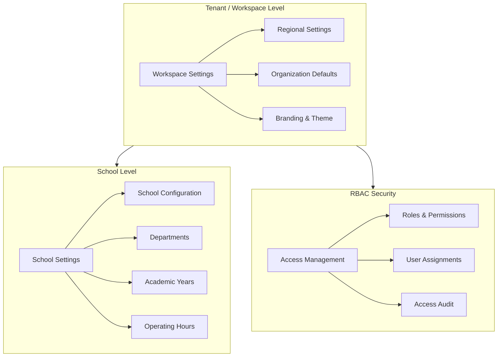
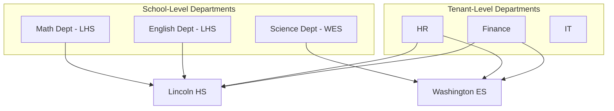

# EdForge SchoolService Architecture and Settings Reorganization

## Executive Summary

This plan restructures the Settings module into a clear hierarchical organization that reflects EdForge's multi-tenant EMIS architecture. The key insight is that settings naturally fall into three tiers:

1. **User Preferences** (per-user) - Theme, personal display preferences
2. **Workspace Settings** (per-tenant) - Organization-wide policies, timezone, locale, academic calendar defaults
3. **School Settings** (per-school) - School-specific configurations, departments, academic years

---

## Architecture Overview



---

## Phase 1: Navigation Restructure and Service Layer

### 1.1 Sidebar Navigation Updates

Update [`apps/shell/src/config/sidebar-modules.ts`](apps/shell/src/config/sidebar-modules.ts) WORKSPACE section:

| Current | New | Route |

|---------|-----|-------

| General Settings | Workspace Settings | `/settings/workspace` |

| Access Policy | RBAC Security | `/settings/security-policies` |

| Schools | School Settings | `/settings/schools` |

### 1.2 Schools Service Layer

Extend [`apps/shell/src/services/tenant.service.ts`](apps/shell/src/services/tenant.service.ts) with full SchoolService API:

```typescript
// New types and endpoints to add:
interface SchoolConfiguration {
  timezone: string
  locale: string
  dateFormat: string
  timeFormat: '12h' | '24h'
  weekStartsOn: 'sunday' | 'monday'
  operatingHours: { dayOfWeek: number; openTime: string; closeTime: string }[]
  gradingScale: 'letter' | 'percentage' | 'points' | 'custom'
  attendancePolicy: 'daily' | 'period' | 'both'
  logoUrl?: string
  primaryColor?: string
}

interface Department {
  id: string
  name: string
  code: string
  scope: 'tenant' | 'school'
  schoolId?: string  // null if tenant-scoped
  headId?: string
  parentDepartmentId?: string
}

interface AcademicYear {
  id: string
  schoolId: string
  name: string
  startDate: string
  endDate: string
  status: 'planning' | 'active' | 'completed'
  terms: Term[]
  isLocked: boolean
}
```

### 1.3 New Routes in [`apps/shell/src/router.tsx`](apps/shell/src/router.tsx)

- `/settings/workspace` - Workspace Settings (tenant-level)
- `/settings/schools` - School list with configuration access
- `/settings/schools/:schoolId` - School detail with tabs
- `/settings/schools/:schoolId/configuration` - School configuration
- `/settings/schools/:schoolId/departments` - School departments
- `/settings/schools/:schoolId/academic-years` - Academic years
- `/settings/security-policies` - RBAC management

---

## Phase 2: Workspace Settings (Tenant-Level)

### Design Rationale

Workspace Settings contain organization-wide defaults that cascade down to schools unless overridden. This creates a predictable inheritance model:

```
Workspace Defaults → School Configuration → Actual Behavior
```

### Configuration Categories for MVP

| Category | Settings | Rationale |

|----------|----------|-----------|

| **Regional** | Default timezone, locale, date/time format | Most schools in a district share these |

| **Calendar** | Default week start, academic year template | Standardization across schools |

| **Branding** | Organization logo, colors | Unified identity |

| **Policies** | Default grading scale, attendance policy | Compliance consistency |

### Temporal Lock Constraint

**Critical Business Rule:** When an academic year is `active`, certain workspace settings become read-only to prevent data integrity issues:

- Timezone cannot change mid-year (affects all timestamps)
- Date format changes could cause reporting inconsistencies
- Academic year dates are locked once active

The UI will show a clear indicator with explanation when settings are locked.

---

## Phase 3: School Settings (School-Level)

### 3.1 School Configuration MVP Features

Based on enterprise EMIS best practices, the following configurations are essential for pilot schools:

| Category | Settings | Business Value |

|----------|----------|----------------|

| **Identity** | Name, code, type, logo | Differentiation and compliance |

| **Location** | Address, timezone (if different from workspace) | State reporting requirements |

| **Contact** | Phone, email, website | Communication channels |

| **Operations** | Operating hours, bell schedule | Attendance calculations |

| **Academic** | Grade levels, grading scale, report card format | Academic integrity |

| **Attendance** | Policy type, tardy threshold, excused absence types | Compliance tracking |

| **Terms** | Semester/quarter/trimester structure | Grade period management |

### 3.2 Department Architecture

This is the complex requirement you mentioned. The solution is a **hybrid scope model**:



**Implementation:**

- `scope: 'tenant'` departments appear in all schools, manage shared resources
- `scope: 'school'` departments are school-specific, manage local staff/budgets
- UI allows tenant admins to choose scope when creating departments
- API: `GET /schools/:schoolId/departments` returns both tenant and school-scoped departments

### 3.3 Academic Year Management

**Temporal Boundary Architecture:**

Academic Year is the most critical temporal boundary in EMIS. All transactional data (grades, attendance, enrollment) is scoped to an academic year.

```typescript
interface AcademicYearStatus {
  'planning': boolean   // Future year, fully editable
  'active': boolean     // Current year, limited edits
  'completed': boolean  // Past year, read-only
}
```

**Business Rules:**

1. Only ONE academic year per school can be `active` at a time
2. Transitioning to `active` is irreversible (cannot go back to `planning`)
3. When active, start/end dates are locked
4. Terms can be adjusted within the year boundaries
5. Completion triggers a confirmation workflow

**UI Design:**

- Timeline visualization showing year progression
- Clear status indicators with color coding
- Prominent warning when making irreversible changes
- Preview of affected data before status transitions

---

## Phase 4: RBAC Security Management

### Design Philosophy

EdForge uses ABAC (Attribute-Based Access Control) powered by Cognito. The RBAC Security page provides a user-friendly interface over this complexity.

### MVP Features

| Feature | Description |

|---------|-------------|

| **Role Overview** | Visual grid showing all roles and their permission sets |

| **User Assignments** | Assign users to schools with specific roles |

| **Custom Roles** | Tenants can create custom roles based on templates |

| **Audit Log** | View who has what access and when it was granted |

### Permission Architecture

The existing [`packages/abac/src/permissions.ts`](packages/abac/src/permissions.ts) defines the permission matrix. The UI will expose this as:

```
Role Templates (System-provided)
├── Principal - Full school access
├── Teacher - Classroom + grades
├── Accountant - Finance cross-school
├── Staff - Limited operational
└── ...

Custom Roles (Tenant-defined)
├── Department Head - Principal subset + dept management
├── Registrar - Enrollment + records
└── [Tenant creates as needed]
```

---

## Phase 5: Implementation Files

### New Pages to Create

| File | Purpose |

|------|---------|

| `apps/shell/src/pages/settings/workspace.tsx` | Tenant workspace settings |

| `apps/shell/src/pages/settings/school-detail.tsx` | School detail with tabs |

| `apps/shell/src/pages/settings/school-configuration.tsx` | School config form |

| `apps/shell/src/pages/settings/school-departments.tsx` | Department management |

| `apps/shell/src/pages/settings/school-academic-years.tsx` | Academic year management |

| `apps/shell/src/pages/settings/rbac-security.tsx` | RBAC management |

### Services to Extend

| File | New Methods |

|------|-------------|

| [`apps/shell/src/services/tenant.service.ts`](apps/shell/src/services/tenant.service.ts) | `getSchoolConfiguration`, `updateSchoolConfiguration`, `getDepartments`, `createDepartment`, `getAcademicYears`, `createAcademicYear`, `updateAcademicYearStatus` |

### Types to Add

| File | Types |

|------|-------|

| [`packages/types/src/tenant.ts`](packages/types/src/tenant.ts) | `SchoolConfiguration`, `Department`, `AcademicYear`, `AcademicYearStatus` |

---

## Preferences Page Simplification

The current [`apps/shell/src/pages/settings/preferences.tsx`](apps/shell/src/pages/settings/preferences.tsx) will be simplified to contain only **user-specific** preferences:

| Stays in Preferences | Moves to Workspace Settings |

|---------------------|----------------------------|

| Theme (light/dark/system) | Default timezone |

| Default school (personal) | Default locale/language |

| | Date format |

| | Time format |

| | Week starts on |

This separation ensures that:

- Users can personalize their theme
- Organization-wide standards are managed centrally
- Schools can override when needed

---

## UI/UX Principles

Following Apple design philosophy and premium SaaS patterns:

1. **Progressive Disclosure** - Show essential settings first, advanced in collapsible sections
2. **Contextual Warnings** - Clear alerts when changing locked/cascading settings
3. **Live Preview** - Show effect of changes before saving
4. **Breadcrumb Navigation** - Clear hierarchy: Settings > School Settings > Lincoln HS > Configuration
5. **Consistent Patterns** - Reuse `SettingsSection`, `SettingsCard` components from shared library
6. **Accessibility** - All settings navigable via keyboard, ARIA labels

---

## Implementation Priority for MVP

| Priority | Feature | Complexity |

|----------|---------|------------|

| P0 | Sidebar navigation restructure | Low |

| P0 | Workspace Settings page (basic) | Medium |

| P1 | School list with detail view | Medium |

| P1 | School configuration page | Medium |

| P1 | Academic Year management | High |

| P2 | Department management | High |

| P2 | RBAC Security overview | High |

| P3 | Custom roles creation | High |

| P3 | Audit logging UI | Medium |